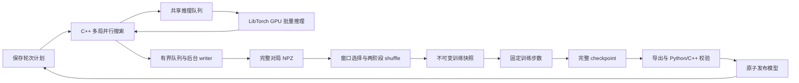

# 运行框架与 AlphaZero 实现

当前实现第一轮 AlphaZero 训练框架，算法语义见 [algorithms.md](algorithms.md)。MuZero / Gumbel 尚未实现，配置检查会拒绝这些选择。

## 参考来源与边界

主要并行架构与训练数据管线参考 KataGo：对局线程共享 evaluator、多推理服务、NN 缓存、原子搜索统计与 mutex pool、有界后台写盘、二进制观测打包、NPZ 文件边界、power-law 回放窗口、随机分桶再桶内洗牌与 multi-wave，以及训练文件预取。源码提交、入口和校验值见 [reference_sources.json](../reference_sources.json)，许可证与改编范围见 [THIRD_PARTY.md](../THIRD_PARTY.md)。平衡开局直接参考 KataGomo；冷启动记账、Renju 与 TorchScript / LibTorch 边界另参考现有 MuZero_V2。

采用用户确定的逐轮编排：固定训练量，按 replay ratio 规划 selfplay。KataGo 的额度桶、Go 专用监督头、搜索/训练增强和常驻分布式异步运行不属于本轮范围。共享其架构不表示已有相同的吞吐、后端优化或训练效果。

## 执行架构



### 对局、搜索与推理

[原生命令](../cpp/src/commands/main.cpp)为每个 worker 建立一个模型服务和多个对局线程。每局独立持有状态、树和随机流，对局共享 evaluator。[Search](../cpp/src/search/search.cpp) 为每局保留搜索线程，逐手派发任务；单线程使用同一实现。

节点展开由共享 mutex / condition-variable pool 协调，以 release/acquire 发布合法动作先验与 child 统计。合法动作全部保留，child 统计按 8、64、全部合法动作三档按需增长；选择扫描已激活 child，并通过排序先验求出未访问动作的最大分数和全部并列候选，不裁剪动作域。节点累计访问与在途数直接参与 PUCT，避免每次扫描全部合法动作求和。每个搜索线程复用状态、路径和候选暂存，AlphaZero 状态按原位复制重置。边分别保存完成访问和在途预约，virtual loss 仅参与调度；回传完成才增加正式访问。失败释放全部预约，搜索返回前等待该手全部任务结束，新增完成模拟量严格符合预算。

对局线程跨对局复用 Search 和搜索线程，重置树与随机流。树销毁采用无需额外分配的迭代遍历；规模较大的独立分支交给已有搜索线程并行回收，避免深树递归析构。并发选择可能读取不同时间的原子统计并改变搜索顺序；单线程 PUCT 与动作并列时的抽样定义不变。

[BatchEvaluator](../cpp/src/inference/batcher.cpp) 的请求具有唯一身份、模型身份和固定输入形状，队列有容量上限。每个 evaluator 固定绑定同一模型、画布和推理精度，多个服务共同消费队列。服务数由 `selfplay.server_threads` 指定，设备仍由独立 worker 的 `devices.selfplay` 项确定。默认采用 KataGo 的立即取队列最多 N 项方式；非零 `batch_wait_us` 可显式增加等待期限，属于性能和调度条件。失败唤醒当前批、队列内以及等待入队的所有调用者。

[TorchBackend](../cpp/src/inference/torch_backend.cpp) 在各自服务线程绑定设备并建立独立 CUDA stream 与 pinned host 输入缓冲区，模型加载一次并共享只读权重，批量前向后一次回传 policy logits / WDL 概率；检查模型契约、画布、输出形状和数值。LibTorch 来自训练使用的同一 PyTorch 环境。多个服务共享模型权重，各自的输入缓冲与工作区仍需要额外显存；同卡并发不保证吞吐更高。

同步 evaluate 调用借用调用者的观测直到结果返回，线程复用请求、等待条件与 cache key 缓冲，服务线程复用 batch 暂存；不再为每次请求复制完整观测或分配 promise。后端直接从观测视图填入 pinned 输入，结果一次回传 FP32 后转换到公共搜索数值类型。

`selfplay.inference_precision` 明确选择 FP32 或 FP16 autocast。FP16 仅适用于 CUDA，归一化仍显式累积 FP32，输出 head 必须实际使用 FP16；训练 AMP 由另一项配置独立决定。导出文件保存 FP32 权重，发布时根据实际推理精度核对数值和记录容差。该后端仍使用 TorchScript / LibTorch，没有移植 KataGo 的专用 CUDA/cuDNN 算子后端。

NN 缓存采用有界直接映射表与分段锁，保存不可变原始 policy logits/WDL 概率。键比较五个二进制空间平面的全部位及四个全局浮点特征的原始字节，包含棋盘尺寸、Renju 执色、棋规和禁手特征开关；哈希只用于选槽，碰撞不会返回其他输入的结果。模型与精度由 evaluator 生命周期隔离。`selfplay.cache_entries = 0` 显式关闭缓存，空间输入必须为二进制，全局特征允许 Renju 黑方的 -1。缓存不合并同时在途的相同请求，也不缓存根噪声或搜索策略。

公共树遍历通过 [SearchState](../cpp/include/etazero/algorithm.h) 获得状态复制、动作域、转移、叶评估、终局值、奖励、折扣与视角转换。AlphaZeroState 提供真实棋盘适配；公共遍历不自行调用五子棋规则。未来 latent 状态可从同一边界接入，当前没有 MuZero 占位类。

### 轮次与设备

[Python 控制器](../python/etazero/runtime.py)依次执行 selfplay → shuffle → train → export。阶段内部保留对局并行、树内并行、后台 writer、shuffle worker 和文件预取，Shell 只负责薄启动。

bootstrap 为 iteration 0，只执行 selfplay，不 shuffle、不训练、不导出初始网络。iteration 1 补足有效训练行并完成首轮训练发布；后续四个阶段合为一次 `iteration`，完成校验发布与状态提交后才增加迭代编号。`.internal/state.json` 的 `iteration` 从 0 开始，表示当前未完成或下一次待处理的迭代；初始化 checkpoint 的迭代编号为 0。`.internal/iterations/<编号>/` 保存计划、阶段状态和 learner 进度，原始分片保存到 `selfplay/iteration_<编号>/`。checkpoint 的 `step` 是迭代内成功的 batch 更新次数，`total_steps` 跨迭代累计。`run.max_iteration` 是整个运行的累计完成目标，0 表示无限迭代；`--iterations` 可临时覆盖目标，时间限制与停止信号仍有效。

`devices.selfplay` 每个列表项启动一个独立 worker，记录设备、worker 身份和种子；可以指定多个 GPU，或同一 GPU 上的多个进程。learner 使用 `devices.train`，当前为单卡训练。没有 DDP 或跨机器调度。

worker 随机流从运行种子、iteration、持久化 attempt 序号和 worker 身份派生，产物 UUID 只负责文件身份。同一配置的独立运行具有一致的 worker 种子，重试使用新序号。实际每局种子随轨迹保存，树内并行调度仍可能影响访问顺序。

每轮使用计划中固定的输入模型，新模型校验发布后，下一轮才换代。[常驻 worker](../python/etazero/native.py) 按请求处理 bootstrap 与补局。随机阶段使用 CPU RandomBackend 经过共享队列与正常搜索，无模型前向或 CUDA 推理分配；每次 attempt 的随机输出由其种子和完整观测决定，不依赖服务线程调度。网络阶段在同一生产阶段复用模型服务和 CUDA 上下文；每次请求仍使用独立 attempt 目录和记录。在进入 shuffle / train 前排空推理、释放 selfplay 模型与 CUDA allocator 缓存，worker 进程保持存活，下一轮明确加载新模型。正常停止阻止新局并取消半局，在途搜索收尾后 writer 排空已完成对局；半局不会写成和棋。控制器退出关闭 worker 输入并等待其退出。

常驻进程仍保留 CUDA 上下文的固定显存开销；训练显存预算须计入该开销。模型权重、推理输入和 allocator 缓存随 release 请求释放。

## 配置组织

每套配置位于 `configs/<name>/`，分为 `run.cfg`、`env.cfg`、`net.cfg`、`selfplay.cfg`、`train.cfg`、`eval.cfg`、`match.cfg`。训练字段以 [config.py](../python/etazero/config.py) 为事实源；评估／比赛仅读取自身文件，字段以 [eval_config.py](../python/etazero/eval_config.py) 为事实源，不参与训练配置身份。

派生配置在 `run.cfg` 的 `[run]` 中使用 `extends = baseline`，父目录名优先在所选配置的同级解析，找不到时在本版本 `configs/` 下解析，因此实验伞目录中的臂也可直接 `extends = baseline` 或 `minimal_test`。解析次序是父配置、当前配置、当前目录的 `*.cfg.local`；父目录本机覆盖不向子配置传播。继承循环、父目录缺失、未知/重复字段、错误文件归属、非法枚举与范围、非法组合或未实现能力，均在启动 worker 前失败。

Python 保存完整生效配置及其 SHA-256 身份，生成 C++ 消费的 `config/effective.cfg`，C++ 不维护第二套默认值。观测、动作、模型输出与原始分片类型由 [schema.py](../python/etazero/schema.py) 定义，构建时生成 C++ 头文件，模型和数据记录契约内容校验身份。

恢复要求生效配置一致，并核对 native 配置未被另外修改。当前不做任意配置热更新，不实现历史格式兼容层；正式实验条件由用户确定。

## 运行目录

| 路径 | 内容 |
|---|---|
| `config/effective.json`、`config/effective.cfg` | 完整生效配置及 native 输入 |
| `logs/` | 原始事件日志、worker stdout/stderr |
| `selfplay/iteration_<编号>/` | 按 attempt 与 worker 分开的完整对局 NPZ |
| `snapshots/` | 不可变 shuffle manifest 和可重建训练 payload |
| `checkpoints/` | 模型、优化器、RNG、数据游标等训练状态 |
| `models/`、`models/current.json` | 已校验推理模型和发布指针；首轮训练前无已发布网络 |
| `training.png` | 每轮提交、正常退出和恢复后自动重建的训练图；也可手动重绘 |
| `logs/performance.png` | 阶段耗时、吞吐与推理统计 |
| `logs/iterations/` | 与整轮提交对应的指标、累计训练时间和模型身份 |
| `.internal/discarded/` | 不参与训练或图表的中断轮原始产物 |
| `.internal/` | run/state/session、锁、iterations、catalog、training_views 和 source 源码证据 |

原始对局和历史证据保持不可变；派生缓存集中存放不影响恢复与快照重建。新配置与轨迹契约不提供旧格式兼容，已有历史目录不会被自动迁移或覆盖。

## 数据链路

### 原始对局分片

[RecordWriter](../cpp/src/selfplay/record.cpp) 经有界队列接收完整对局，按行数或时间限制批量写压缩 NPZ。writer 预留固定容量的数组，容量包括阈值后的一个完整对局余量，flush 后复用存储；不再积累整组对局后重建每个数组。保留整个末尾对局，分片行数可能略超阈值。数值数组与 offset 表达轨迹，不使用 pickle 对象数组。

空间观测为 `uint8[N,5,ceil(canvas²/8)]`，独立的 `globals` 为 `float32[N,4]`，各平面按行优先顺序使用高位在前的 bit packing，最后一个字节的多余位必须为零，与 KataGo 的 packBits / NumPy unpackbits 位序一致。压缩 ZIP 时直接流式读取数组，不构造另一份完整 NPY 字节串。

每局保存 T+1 个观测和行棋方、T 个动作与奖励、策略监督、完成访问数、新增模拟数、行为温度、真实终局与原因，以及尺寸、棋规、种子和唯一对局身份。T 包括所有开局动作；`train_mask` 的前缀为零，前缀 policy/visits/simulations/temperature 为零，其余动作有真实搜索监督。另保存 opening/balanced/policy moves、attempts、status、后继视角 start value 与失败原因。每步另存 network/search WDL、cheap 标记、policy/value surprise、期望 target weight 和实际 `row_repeats`。分片元数据 `plies` 为全部动作数，`rows=sum(row_repeats)` 为实际采样训练行数；独立 policy init 若已结束整局，可保留零训练行的完整轨迹。分片元数据关联 run、iteration、worker、attempt、配置、源码与输入模型。

先写同文件系统的临时文件，flush、fsync 后重命名，再 fsync 目录。每次 worker 启动使用新的 attempt 目录，拒绝覆盖已有输出；读取只消费已发布的 `.npz`。写入错误唤醒生产者并传播失败。

[读取与检查](../python/etazero/data.py)核对类型、形状、offset、交替视角、逐手棋盘变化、mask、访问数、策略分布和奖励。AlphaZero WDL 目标由终局结果和该状态行棋方派生为 W/D/L one-hot。训练视图按 `row_repeats` 重复，原始轨迹不重复。SQLite catalog 为可从原始分片重建的清单，唯一约束防止重复计数；完整轨迹始终保留。启动时扫描历史产物，运行中仅扫描当前 iteration，事务内更新累计有效行数、局数和轻量对局统计；开局前缀不进入 catalog 行数或训练视图。逐轮胜和负、完整局长、有效行数／局及开局统计从索引汇总，不重复解压全轨迹；近期窗口通过索引从新到旧选取，不反复读取全部历史 metadata。

### 窗口与 shuffle

[shuffler](../python/etazero/shuffle.py) 使用 KataGo 的 power-law 增长窗口，采用其默认的 `taper_window_scale = min_rows`，不设独立尺度或窗口上限。从近期完整分片向前选择直到达到目标窗口，因此可能略超目标行数。

`[replay]` 只包含四项：`min_rows` 同时作为累计产样的训练启动门槛和公式起点/下限，`taper_exponent` 控制增长指数，`expand_per_row` 控制初始增长速度，`keep_target_rows` 控制每次 shuffle 输出的目标采样行数。累计有效行数为 N、门槛为 m、指数为 p、增长系数为 a 时，目标窗口为 `max(m, int(m + a * (N**p - m**p) / (p * m**(p-1))))`。

`keep_target_rows` 接受正整数或 `all`，后者保留整个窗口。选择窗口后，以 `min(1, keep_target_rows / 实际窗口行数)` 为采样比例，打乱输入分片的组装顺序。按照 KataGo 的 shardify 做法，每个输入组取 `round(组行数 * 采样比例)` 个随机行，不放回采样，再分桶；因此总输出接近目标值，会受到各组取整影响。它限制每次输出的训练样本量，窗口仍继续增长。快照分别记录期望窗口、实际窗口、采样比例和实际输出行数；`training.replay_ratio` 单独控制产样预算，shuffle 降采样不改变累计实际产样计数。

两阶段 shuffle 按有界输入组解压、检查轨迹，将有效行独立随机分桶，再在桶内统一排列并分成训练文件。分桶采用 KataGo 的计数与连续切片组织：独立均匀标签得到桶大小，随机行排列按累计大小切片，避免每个桶重新扫描全部标签。条件于桶大小的所有行分配等概率；样本集合与分布保持，具体种子对应的排列会改变。整个过程保持观测打包布局，随机桶超出行数上限时继续分桶；合并逐个输入复制到一次分配的目标数组，不同时保留全部输入碎片。并行进程数、输入组行数、桶行数和输出分片行数均由配置限制，控制器跨轮复用 spawn 进程池。

首次消费原始分片时完成 SHA-256 与全轨迹验证，然后在 `.internal/training_views/` 保存未压缩的紧凑训练视图和来源证书。后续 shuffle 校验缓存哈希；原始文件大小或 mtime 变化时重新核对来源哈希，避免窗口内反复解压和逐步轨迹验证。原始分片遵循不可变约定，缓存不代替原始轨迹；损坏缓存明确报错。已离开当前窗口的视图在本轮提交后回收。

`shuffle.waves > 1` 先在输入组中完成一次采样，将保留的每行独立均匀分配到一个 wave，再逐 wave 执行两阶段 shuffle；第二阶段不重复采样，完成后立即删除该 wave 的临时文件。额外 I/O 换取更低的同时存活分桶文件数量，不改变已选样本集合。

`[shuffle]` 管理 worker 数、组/桶/训练分片行数、wave 数、内存、临时目录与快照保留数。`shuffle.memory_mb` 为全部 worker 的数组内存规划预算。按实际观测、policy、visits 布局估算，必要时降低输入组与桶行数；不能容纳一个完整原始分片或训练分片时，在开始写入前报错。该估算不包含 Python 进程、分配器与 OS 开销，不是进程 RSS 的硬上限。快照 manifest 和 `shuffle_resources` 事件记录有效行数限制、采样比例、输出行数估算、数组内存、临时磁盘与文件数量估算。磁盘容量在开始前核对，随机波动、压缩开销和外部磁盘使用仍可能使实际值不同。

`shuffle.temp_dir` 可指定独立临时目录，空值使用 snapshots 所在目录。每次尝试使用唯一私有工作目录，中间 NPZ 不压缩、不哈希、不 fsync；最终训练文件仍压缩、校验并持久化后发布。正常完成或异常退出清理本次临时目录，原始分片保持不变；SIGKILL/断电可能留下未发布目录，需要删除对应的 `.shuffle_*` / `.tmp_*` 目录后重建。

全部文件与 manifest 在临时目录准备，记录来源及 SHA-256、随机种子、窗口行数、输出行数与校验值，完成后原子发布整个快照。learner 持有本轮快照，不混读不同代次。

`shuffle.snapshot_keep` 限制保留完整 payload 的已完成快照数量，其余只回收可重建的 `data/`，保留 manifest、配方、原始对局与 checkpoint。读取被回收快照时，在文件锁内用原来源、随机种子和资源计划重建相同采样，要求文件名、行数与 SHA-256 全部符合原 manifest，再原子发布；因此 checkpoint 的数据游标仍可恢复。原始对局本身不按此配置删除，磁盘占用仍随累计产样增长。

[BatchReader](../python/etazero/reader.py) 有界预取、解压和校验后续文件，保存文件顺序、epoch、文件/行位置与采样 RNG。batch 可以跨文件和 epoch 补齐，不丢弃最后几行或缩小 batch。预取文件和跨文件 batch 拼接保持紧凑布局，只解包当前 batch。窗口内样本允许重复消费，按行训练时长局贡献更多行，所有有效训练行等权。

有界后台线程准备完整 batch，执行跨文件拼接与当前 batch 的解包；每个 batch 携带消费后的游标。`training.cuda_prefetch` 启用独立上传 stream 和两个可复用 pinned host slot，在计算当前 batch 时上传下一 batch。event 保证计算等待上传、CPU 不覆盖仍在 DMA 的槽，record_stream 保证 GPU 存储生命周期。checkpoint 保存最后成功更新所消费的游标，而非后台预读推进后的游标；停止或恢复时未消费的预读 batch 可以丢弃并重新读取。CPU learner 继续同步传输路径。

## 固定训练量与自对弈产量

`training.replay_ratio` 是训练样本消费次数与新增 selfplay 实际采样行数的目标比例，重复 shuffle、降采样、窗口淘汰和重复消费不改变分母。

冷启动分为两个独立阶段：iteration 0 完成 `bootstrap_games` 局随机评估搜索，只测量有效行数／局，不训练；中断后按已发布完整对局数补足剩余局数。iteration 1 根据实测均值估算 `min_rows` 缺口，实际不足就继续补局，直至达到门槛。两阶段均跳过网络平衡开局与 policy init，仍执行正常搜索和真实终局监督。

首次有效训练、模型校验与发布完成后，在同一次持久化提交中保存实际累计行数 `replay_origin_rows`，将 `target_rows` 重置为该值。此后的恢复沿用已提交起点，不再次重置。首轮及 bootstrap 多产的数据保留在回放池中，但不抵扣 iteration 2 以后的新增预算。

```text
U_i = train_steps_i * batch_size_i
D_1 = iteration 1 提交时的实际累计有效行数
D_i = D_(i-1) + U_i / replay_ratio_i  (i >= 2)
C = 累计已提交的实际采样行数（按 row_repeats 计数）
deficit = max(0, D_i - C)
rows_per_game = 近期完成对局有效行数之和 / 对局数
games_i = max(1, ceil(deficit / rows_per_game))
```

累计目标保留非整数，只在换算局数时取整。计划在 selfplay 前持久化，中断重跑从上一轮已提交状态重新建立同一目标 D；作废轮的完整对局也不抵扣新一次尝试的产样预算。正常整局产量误差进入下一轮，不改变训练量；每个正常轮次至少生成一局，沿用 MuZero V2 的调度边界。

例如每轮 1000 步、batch 128、ratio 8，iteration 2 新增目标为 16000 行，均值 80 行／局时计划 200 局，与冷启动累计多产量无关。以后正常轮次多产 4000 行时，下一轮约 150 局。局数是估计，训练仍完成 1000 步。日志中的累计实际 ratio 使用已提交训练消费量除以累计有效行数，包含冷启动；该观测量与排除冷启动的产样预算分开解释。

## 模型发布与恢复

[learner](../python/etazero/training.py) 实现固定步数、batch 级 D4、SGD / AdamW、分组 LR/WD、warmup、范数自适应衰减、Lookahead 与 SWA；配置入口在 `train.cfg`，数学与适配边界见 [学习与数据使用](algorithms.md#学习与数据使用)。非有限 loss 或无法恢复的非有限梯度明确失败；可恢复的 FP16 缩放溢出按下述机制重试，成功更新才计数。

`training.compile` 将网络与完整损失联合交给 torch.compile / Inductor，使用 fullgraph 捕获，超过重编译限制时明确失败，避免长运行静默退回 eager；首次 shape / 精度编译有额外耗时。选择 AdamW 时 CUDA 使用 fused 实现，CPU 使用普通实现；SGD 使用 momentum 0.9。编译和融合可能改变浮点归约顺序，属于显式执行条件，不能据此声称与旧 eager 路径逐位一致。SGD momentum 或 AdamW 的一阶／二阶矩与 step 随 checkpoint 保存并恢复。

FP16 的缩放溢出由 GradScaler 降低 scale，并对同一次前向的图重新反向传播；前向统计、随机流和数据游标只推进一次，实际更新成功后才增加步数。每次溢出显式记录，持续溢出达到实现中的重试上限会报错。BF16 / FP32 的非有限梯度直接失败。

checkpoint 保存训练模型、优化器、范数基准与 snapshot、Lookahead slow 权重与计数、SWA 权重/buffers/采样累积、AMP scaler、训练计数、Python / NumPy / Torch / CUDA RNG、数据读取状态、iteration 和本轮步数、配置契约、源码身份、父 checkpoint 与已提交更新身份。warmup 由已恢复的成功更新样本计数推导。使用唯一文件名，不覆盖历史产物，持久化后才原子更新 learner 指针。

[exporter](../python/etazero/export.py) 优先使用已采样的 SWA 权重，无采样时使用训练权重，并在 manifest 中记录选择与采样次数。在实际推理设备上预计算 evaluation normalization 的 FP32 逆标准差，保留原归一化运算顺序、卷积权重、精度设置与 mask 位置，再导出独立 TorchScript 模型，核对 metadata 和全部配置尺寸/规则的所选权重网络 eager / scripted 输出，包含 JIT 预热后的优化图，再真实加载 C++ 后端核对数值。合并归一化 scale / offset 或将其乘进卷积权重都会改变舍入，CPU / CUDA 的逆平方根也可能有不同舍入；微小差异可被后续 TF32 卷积量化放大。归一化仅对新建中间量分开执行原地乘、加，阻止 JIT 预热后的乘加融合改变舍入。C++ 单局推理与同样 batch 大小的 eager 输出比较，避免不同 batch 的卷积 kernel 差异干扰校验。不修改训练网络和 checkpoint，通过原有精度容差检查后生成不可变模型目录，整轮提交后更新 `models/current.json`，身份来自 checkpoint，不依赖 mtime，没有比赛胜率门控。

`.internal/state.json` 是整轮提交的唯一权威：本轮完成自对弈、shuffle、训练、模型校验和绘图，保存 `logs/iterations/<iteration>.json` 后才原子推进 state。`models/current.json` 在提交后更新，启动时可从 state 重建。iteration 0 的 bootstrap 也按完整轮提交。

无论中断发生在 selfplay、shuffle、train、export 还是最终提交前，重启都从上一完整轮的 checkpoint 重跑整轮，不采用本轮 `learner.json`。中断轮的对局、checkpoint、快照、模型、轮次状态和候选指标移入 `.internal/discarded/<id>/`，保留原始字节；catalog 作为派生索引重建。半局始终不构造监督。已经原子提交但发布指针尚未更新的轮次仍有效，不重复训练。底层 learner 的 checkpoint/游标恢复能力用于内部验证，用户训练入口采用整轮恢复。


运行锁禁止同目录多个控制器，在取得锁后以 `.internal/run.json` 判断是否自动续训；非空但缺少运行记录的目录不作为新运行使用。续训沿用累计轮数目标，已达到目标时不重复训练，追加训练通过 `--iterations` 提高目标。启动与默认输出路径见 [README](../README.md#续训与评估)。缺失文件、重复数据、契约不符、配置变化或模型/checkpoint 校验失败均报错，不退化为仅加载权重。新运行 `--weights` 只导入模型状态，并保存导入来源校验值，自动续训同样拒绝该参数。

### 运行观测与证据

每次执行保存生效配置、完整源码快照、Git 身份与工作树状态、依赖与硬件、设备、种子、worker 命令、stdout/stderr，以及模型和数据来源。源码快照排除版本根目录的 `data/`、构建和运行产物，避免把其他运行的数据纳入源码身份。构建清单记录源码与二进制校验值，运行前拒绝过期构建。

`logs/events.jsonl` 记录计划、缺口、实际产量、推理请求/批数/最大批大小/队列等待、缓存命中与各服务实际处理行数、shuffle 资源估算、损失与梯度、checkpoint、发布和阶段耗时。绘图按 checkpoint 提交身份筛选 loss，回滚更新不冒充有效进度，保留原始值，不隐式平滑。

日志由有界后台队列批量写入，最长每秒执行一次 fsync；checkpoint 的指标与提交事件先通过持久化屏障，随后更新 learner 指针，轮次状态提交也经过屏障。强制退出可能丢失尚未提交的日志尾部，已提交 checkpoint 的更新指标保持可追溯。

训练预算和 Elo 使用 state 与逐轮指标中的 `elapsed_seconds`：仅累加成功提交轮从计划准备到绘图完成的墙钟，包含 bootstrap、自对弈、shuffle、训练和导出，排除初始化、启动恢复、暂停、排队和作废尝试。`max_seconds` 在轮次边界检查，可能超出一轮；不将最后模型假定为恰好位于预算点。日志 `active_seconds` 与 heartbeat 保留实际活动耗时作为审计信息，包含作废工作，不作训练比较横轴。阶段时间不累加线程耗时冒充墙钟。

## 验收与限制

```bash
# 在版本目录执行
conda run -n pytorch ctest --test-dir build --output-on-failure
conda run -n pytorch pytest -q tests

# 在宿主 CUDA 可访问的执行环境运行
ETAZERO_GPU_TESTS=1 conda run -n pytorch pytest -q tests
```

[开局检查](../cpp/tests/opening_test.cpp)覆盖随机评估复现、双方视角、开局轨迹、重试与拒绝率切换、取消、失败和独立 policy init。[C++ 检查](../cpp/tests/core_test.cpp)覆盖三种棋规、长连、满盘、递归活三参考样例、价值视角、终局停止推理、精确模拟预算、穷举 PUCT 对照、分级 child 增长与大树回收、子树复用、状态适配、失败回滚与等待者唤醒。[搜索技巧检查](../cpp/tests/search_features_test.cpp)覆盖 WDL 与和棋回传、FPU 手算值、半均匀噪声、强制探索与剪枝、train/eval LCB 区别、cheap 树复用、surprise 重分配和随机取整。[Python 检查](../tests/test_python.py)覆盖配置、独立数学样例、轨迹与目标、窗口、bit 顺序和非整字节尾部、随机分桶分布、单 wave / multi-wave 守恒、视图缓存校验、快照精确重建、增量索引、日志持久化屏障、失败清理、资源规划、重复消费和游标恢复。[真实 GPU 检查](../tests/test_gpu.py)覆盖 iteration 0～3、bootstrap 中断整轮重跑、首轮记账重置后的恢复、开局前缀过滤、组批、两轮发布、全部测试尺寸/规则的数值、先后手比赛、AMP、eager 与 compiled 固定样本续训一致性、强制终止训练、整轮故障恢复、快照回收后的旧数据恢复、多 worker 和 selfplay 信号收尾、常驻协议的 Unicode / 换行路径与退出，以及多推理服务、FP16 推理、归一化预计算精度、紧凑 NPZ 与 multi-wave 的联通。

验证环境为 RTX 5090、PyTorch 2.12.0+cu132 与小规模配置。多 worker 的验收使用同一 GPU 上两个进程，多物理 GPU 尚无对应硬件验证。固定样本 learner 恢复的一致性结论限于相同环境，并行 selfplay 不承诺逐位复现。不保存半局和全部在途树。

专用原生推理算子后端、DDP rank 数据分片及各 rank 状态恢复、跨阶段异步流水线仍未实现。当前使用单卡逐轮语义，CUDA 上传 stream、派生视图缓存和可恢复快照回收为 EtaZero 的实现适配，并非直接复制本地 KataGo reader。

可运行、恢复正确与棋力提升是不同层次的证据，工程验收不能替代正式训练、算法收益比较或目标负载吞吐测量。


## 训练图与性能图

[plotting.py](../python/etazero/plotting.py) 根据 `logs/events.jsonl` 和 checkpoint 的 sidecar 提交链重建图。`training.png` 使用 MuZero V2 的配色与六面板阅读顺序，AlphaZero 只展示真实存在的胜负、局长、loss 与梯度指标。总局长包含开局动作，有效行数排除开局并按采样次数计数；自对弈横轴为迭代完成时的累计有效行数，包含 iteration 0 的 bootstrap。训练横轴从 iteration 1 起，loss 与梯度按该轮已提交更新取算术均值，无平滑。梯度范数为整个网络裁剪前的 L2 范数；loss 分量只有 policy 与 value，优化器解耦衰减不计入 loss。

已完成轮次的自对弈统计取最后一次尝试的对应日志。训练指标只采用 state checkpoint 提交链中的 update ID，并按 ID 去重；当前未完成轮次、未保存更新和废弃分支均不显示。阶段耗时和推理计数只取成功尝试，原始失败日志仍保留供审计。日志中间损坏会报错，仅末尾未完成 JSON 可忽略。

`logs/performance.png` 单独显示各阶段已完成尝试的累计 wall seconds、有效行／自对弈秒、已提交训练样本／训练秒，以及 NN 平均 batch、每请求排队微秒和缓存命中率。训练耗时包含对象创建、数据等待、计算和 checkpoint 等开销。没有完成事件的中断阶段缺少耗时，不进入分母；当前未完成训练轮次也不显示吞吐，因此这些图不能直接作为完整跨中断端到端性能比较。推理计数按 iteration、attempt、worker 去重。bootstrap 使用 random evaluator，未发生网络组批时相关面板无值。

每轮在 state 提交前先 flush 日志并准备两张 PNG，将绘图耗时计入本轮；controller 正常返回和重启时可从已提交 state 重建；绘图不修改 checkpoint、数据或随机流。`bash scripts/run.sh plot --run-dir <实验目录>` 可手动重建，`--plot` 保留为返回后的显式重绘选项。绘图异常会明确报错，已提交训练状态保留，重启可重建。

## 自动实验

[scripts/autoexp.sh](../scripts/autoexp.sh) 使用 Conda `pytorch` 运行 [experiment.py](../python/etazero/experiment.py)，不执行 `exp.cfg` 中的 shell 代码。示例为 [autoexp_example](../configs/autoexp_example/exp.cfg)，只提供两个相同的小规模工程验收臂，不定义研究对照或正式训练预算。

实验伞目录包含 `exp.cfg` 和实验臂的直接子目录。每臂须有 `run.cfg`，可继承本版本 baseline 或其他配置，完整字段仍以 `config.py` 为准。`exp.cfg` 的 `[experiment]` 要求以下字段：

| 字段 | 语义 |
|---|---|
| `max_iteration` | 每臂累计完成训练轮数上限，0 不限 |
| `max_seconds` | 每臂累计已提交完整轮次墙钟上限，0 不限；不含排队、暂停、启动恢复和作废轮次 |
| `arm_gpus` | GPU 编号或 GPU/MIG UUID 的逗号列表，每槽同时一个臂；空值串行使用各臂原有 devices |
| `shared_init` | true/false；按网络结构和 seed 分组共享初始模型权重 |

两个预算至少一个为正，先达到任一预算即完成。预算通过普通训练入口的 `--iterations`、`--max-seconds` 覆盖此次调用，不改变生效配置，并记录在 `session_start` 的实际停止上限中；默认不自动构建，缺失或过期的 native binary 提示先执行 `scripts/build.sh`。时间上限在完整轮次边界检查，可能超过一轮的预算余量。

`MAX_ITERS`、`MAX_TIME_SECONDS`、`ARM_GPUS`、`SHARED_INIT` 可覆盖伞配置，`SHARED_INIT` 使用 true/false。`CONFIG_DIR` 或 `--config-dir` 选择伞目录，`DRY_RUN=1` 或 `--dry-run` 仅打印解析计划，不创建目录、初始化权重或启动任何任务。`--binary` 指定本版本已验证构建；`--work-dir` 指定调度产物目录，默认 `data/experiments/<伞目录名>_<路径摘要>/`。

指定 GPU 槽位时，子进程的 `CUDA_VISIBLE_DEVICES` 设为该槽，CUDA devices 映射为 `cuda:0`，CPU devices 保留。每臂至多一个 selfplay device，多设备配置会明确拒绝；GPU 槽位不得重复。每臂 `run.run_dir` 为独立目录，重复、嵌套或包含调度目录的路径会在启动前拒绝。GPU 槽位仅控制本次 scheduler，不管理外部任务或保留宿主 GPU。

共享初始化文件保存于调度目录 `.internal/initializations/`，按网络结构、seed 与契约分组并校验 SHA-256。它只携带模型参数及 buffers，各臂重新初始化 optimizer、计数和 RNG；random bootstrap 仍各自生成，不共享对局、回放或首轮训练后的模型。结构或种子不同的臂得到不同初始化；相同种子的随机对局可能相同，但产物与生命周期独立。`shared_init = false` 时各臂由自己的初始化路径启动。

调度目录公开 `configs/<臂名>/` 的解析配置与 `logs/<臂名>.runner.log`，内部身份、计划、状态与锁位于 `.internal/`。恢复时重新检查 run 生效配置和初始权重校验值，根据持久化 state 及累计已提交轮次时间 跳过已达预算的臂，否则恢复。臂配置、成员、输出目录和 shared_init 必须与调度身份一致；可以提高统一预算或调整 GPU 槽位，改变实验条件使用新配置和新产物目录。并发启动同一伞目录会被锁拒绝。

SIGINT/SIGTERM 停止排队，转发到运行中的 Python controller，由 controller 关闭 native worker，尚未整轮提交的产物保留待下次启动归档。调度器返回 130；中断臂下次从上一个完整轮重跑。某臂失败或意外在预算完成前退出时，调度器停止其他臂并报错，不将失败记作完成。状态文件仅是可查看的调度记录，完成判断以实际运行证据为准。
