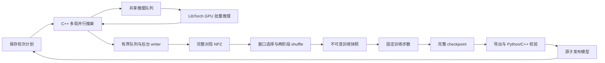

# 运行框架与 AlphaZero 实现

当前实现第一轮 AlphaZero 训练框架，算法语义见 [algorithms.md](algorithms.md)。MuZero / Gumbel 尚未实现，配置检查会拒绝这些选择。

## 参考来源与边界

主要并行架构与训练数据管线参考 KataGo：对局线程共享 evaluator、推理服务器组批、有界后台写盘、NPZ 文件边界、power-law 回放窗口、随机分桶再桶内洗牌，以及训练文件预取。源码提交、入口和校验值见 [reference_sources.json](../reference_sources.json)，许可证与改编范围见 [THIRD_PARTY.md](../THIRD_PARTY.md)。Renju 与 TorchScript / LibTorch 边界另参考现有 MuZero_V2。

采用用户确定的逐轮编排：固定训练量，按 replay ratio 规划 selfplay。KataGo 的额度桶、Go 专用监督头、搜索/训练增强和常驻分布式异步运行不属于本轮范围。共享其架构不表示已有相同的吞吐、后端优化或训练效果。

## 执行架构



### 对局、搜索与推理

[原生命令](../cpp/src/commands/main.cpp)为每个 worker 建立一个模型服务和多个对局线程。每局独立持有状态、树和随机流，对局共享 evaluator。[Search](../cpp/src/search/search.cpp) 为每局保留搜索线程，逐手派发任务；单线程使用同一实现。

共享节点使用展开互斥与等待通知。边分别保存完成访问和在途预约，virtual loss 仅参与调度；回传完成才增加正式访问。失败释放全部预约，搜索返回前等待该手全部任务结束，新增完成模拟量严格符合预算。

[BatchEvaluator](../cpp/src/inference/batcher.cpp) 的请求具有唯一身份、模型身份和固定输入形状，队列有容量上限。服务绑定同一模型和画布。默认采用 KataGo 的立即取队列最多 N 项方式；非零 `batch_wait_us` 可显式增加等待期限，属于性能和调度条件。失败唤醒当前批、队列内以及等待入队的所有调用者。

[TorchBackend](../cpp/src/inference/torch_backend.cpp) 复用 pinned host 输入缓冲区，批量前向后一次回传 policy/value；检查模型契约、画布、输出形状和数值。LibTorch 来自训练使用的同一 PyTorch 环境。

公共树遍历通过 [SearchState](../cpp/include/etazero/algorithm.h) 获得状态复制、动作域、转移、叶评估、终局值、奖励、折扣与视角转换。AlphaZeroState 提供真实棋盘适配；公共遍历不自行调用五子棋规则。未来 latent 状态可从同一边界接入，当前没有 MuZero 占位类。

### 轮次与设备

[Python 控制器](../python/etazero/runtime.py)依次执行 selfplay → shuffle → train → export。阶段内部保留对局并行、树内并行、后台 writer、shuffle worker 和文件预取，Shell 只负责薄启动。

`devices.selfplay` 每个列表项启动一个独立 worker，记录设备、worker 身份和种子；可以指定多个 GPU，或同一 GPU 上的多个进程。learner 使用 `devices.train`，当前为单卡训练。没有 DDP 或跨机器调度。

worker 随机流从运行种子、cycle、持久化 attempt 序号和 worker 身份派生，产物 UUID 只负责文件身份。同一配置的独立运行具有一致的 worker 种子，重试使用新序号。实际每局种子随轨迹保存，树内并行调度仍可能影响访问顺序。

每轮使用计划中固定的输入模型，新模型校验发布后，下一轮才换代。当前每次生产阶段启动 worker，阶段结束退出，不覆盖尚在使用的权重。正常停止阻止新局并取消半局，在途搜索收尾后 writer 排空已完成对局；半局不会写成和棋。

## 配置组织

每套配置位于 `configs/<name>/`，分为 `run.cfg`、`env.cfg`、`net.cfg`、`selfplay.cfg`、`train.cfg`、`eval.cfg`、`match.cfg`。字段、类型与文件归属以 [config.py](../python/etazero/config.py) 为唯一校验定义。

派生配置在 `run.cfg` 的 `[run]` 中使用 `extends = baseline`，父目录相对 `configs/` 解析。解析次序是父配置、当前配置、当前目录的 `*.cfg.local`；父目录本机覆盖不向子配置传播。继承循环、父目录缺失、未知/重复字段、错误文件归属、非法枚举与范围、非法组合或未实现能力，均在启动 worker 前失败。

Python 保存完整生效配置及其 SHA-256 身份，生成 C++ 消费的 `effective.cfg`，C++ 不维护第二套默认值。观测、动作、模型输出与原始分片类型由 [schema.py](../python/etazero/schema.py) 定义，构建时生成 C++ 头文件，模型和数据记录契约内容校验身份。

恢复要求生效配置一致，并核对 native 配置未被另外修改。当前不做任意配置热更新，不实现历史格式兼容层；正式实验条件由用户确定。

## 数据链路

### 原始对局分片

[RecordWriter](../cpp/src/selfplay/record.cpp) 经有界队列接收完整对局，按行数或时间限制批量写压缩 NPZ。保留整个末尾对局，分片行数可能略超阈值。数值数组与 offset 表达轨迹，不使用 pickle 对象数组。

每局保存 T+1 个观测和行棋方、T 个动作与奖励、策略监督、完成访问数、新增模拟数、行为温度、真实终局与原因，以及尺寸、棋规、种子和唯一对局身份。分片元数据关联 run、cycle、worker、attempt、配置、源码与输入模型。

先写同文件系统的临时文件，flush、fsync 后重命名，再 fsync 目录。每次 worker 启动使用新的 attempt 目录，拒绝覆盖已有输出；读取只消费已发布的 `.npz`。写入错误唤醒生产者并传播失败。

[读取与检查](../python/etazero/data.py)核对类型、形状、offset、交替视角、逐手棋盘变化、mask、访问数、策略分布和奖励。AlphaZero 价值目标由终局结果乘以该状态行棋方派生。SQLite catalog 为可从原始分片重建的清单，唯一约束防止重复计数；完整轨迹始终保留。

### 窗口与 shuffle

[shuffler](../python/etazero/shuffle.py) 提供固定窗口和 KataGo 的 power-law 增长窗口，公式按固定参考来源改编，参数由 replay 配置明确给出。从近期完整分片向前选择直到达到目标窗口，因此可能略超目标行数。

两阶段 shuffle 按有界输入组解压、检查轨迹，将有效行独立随机分桶，再在桶内统一排列并分成训练文件。随机桶超出行数上限时继续分桶。并行进程数、输入组行数、桶行数和输出分片行数均由配置限制，张量布局使用 EtaZero 契约。

全部文件与 manifest 在临时目录准备，记录来源及 SHA-256、随机种子、窗口行数、输出行数与校验值，完成后原子发布整个快照。learner 持有本轮快照，不混读不同代次。

[BatchReader](../python/etazero/reader.py) 有界预取、解压和校验后续文件，保存文件顺序、epoch、文件/行位置与采样 RNG。batch 可以跨文件和 epoch 补齐，不丢弃最后几行或缩小 batch。窗口内样本允许重复消费，按行训练时长局贡献更多行，所有有效训练行等权。

## 固定训练量与自对弈产量

`replay_ratio` 是训练样本消费次数与新增唯一 selfplay 有效行数的目标比例，重复 shuffle、窗口淘汰和重复消费不改变分母。

```text
U_i = train_steps_i * batch_size_i
D_i = D_(i-1) + U_i / replay_ratio_i
C = 累计已提交的唯一有效行数
deficit = max(0, D_i - C)
rows_per_game = 近期完成对局有效行数之和 / 对局数
games_i = ceil(deficit / rows_per_game)
```

累计目标保留非整数，只在换算局数时取整。计划在 selfplay 前持久化，重试沿用同一 D。产样误差进入下一轮，不改变训练量；零缺口时允许不生成新局。

冷启动先保存并导出随机初始化的真实网络。缺少产样统计时先执行有界 probe，再用实测均值计算余量，同时满足 `min_rows` 启动门槛。probe 与补局数据均计入 C，不额外扩大 D，持续没有有效产样会明确失败。

例如每轮 1000 步、batch 128、ratio 8，目标平均新增 16000 行；均值 80 行/局时约 200 局，此前多产 4000 行时约 150 局。局数是估计，训练仍完成 1000 步。实际 ratio 使用已提交 checkpoint 的累计训练样本消费量除以累计唯一有效行数；未执行或回滚的更新不计入有效进度。

## 模型发布与恢复

[learner](../python/etazero/training.py) 实现固定步数、SGD / Adam、显式 L2、可选梯度裁剪，以及关闭 AMP / float16 / bfloat16 模式。当前学习率保持配置值，没有额外 scheduler；优化器 weight decay 为零，不重复正则化。非有限 loss 或无法恢复的非有限梯度明确失败；可恢复的 FP16 缩放溢出按下述机制重试，成功更新才计数。

FP16 的缩放溢出由 GradScaler 降低 scale，并对同一次前向的图重新反向传播；前向统计、随机流和数据游标只推进一次，实际更新成功后才增加步数。每次溢出显式记录，持续溢出达到实现中的重试上限会报错。BF16 / FP32 的非有限梯度直接失败。

checkpoint 保存模型、优化器、AMP scaler、训练计数、Python / NumPy / Torch / CUDA RNG、数据读取状态、cycle 和本轮步数、配置契约、源码身份、父 checkpoint 与已提交更新身份。使用唯一文件名，不覆盖历史产物，持久化后才原子更新 learner 指针。

[exporter](../python/etazero/export.py) 导出独立 TorchScript 模型，核对 metadata 和全部配置尺寸/规则的 eager / scripted 输出，再真实加载 C++ 后端核对数值。通过后发布不可变模型目录并更新 `current_model.json`，身份来自 checkpoint，不依赖 mtime，没有比赛胜率门控。

| 中断阶段 | 恢复行为 |
|---|---|
| selfplay | 扫描已发布分片，沿用 D、重算缺口；半局和临时文件不计数 |
| shuffle | 重建本轮快照，不重跑已完成的 selfplay 阶段 |
| train | 恢复最近完整 checkpoint、采样位置与 RNG，只补剩余更新 |
| export | 从本轮完成 checkpoint 继续导出，不重复训练 |
| 已发布、本轮尚未提交 | 核对模型与 checkpoint 后幂等提交，再进入下一轮 |

运行锁禁止同目录多个控制器。缺失文件、重复数据、契约不符、配置变化或模型/checkpoint 校验失败均报错，不退化为仅加载权重。新运行 `--weights` 只导入模型状态，并保存导入来源校验值。

### 运行观测与证据

每次执行保存生效配置、完整源码快照、Git 身份与工作树状态、依赖与硬件、设备、种子、worker 命令、stdout/stderr，以及模型和数据来源。构建清单记录源码与二进制校验值，运行前拒绝过期构建。

`events.jsonl` 记录计划、缺口、实际产量、推理请求/批数/最大批大小/队列等待、损失与梯度、checkpoint、发布和阶段耗时。绘图按 checkpoint 提交身份筛选 loss，回滚更新不冒充有效进度，保留原始值，不隐式平滑。

墙钟累计实际活动区间，暂停不计入，重做工作计入。heartbeat 持久化活动时间，强制终止时最后不足一秒的区间可能未记录。阶段耗时按每次尝试保存，不累加线程耗时当作墙钟。`max_seconds` 为停止请求预算，安全收尾可能超过它。

## 验收与限制

```bash
# 在版本目录执行
conda run -n pytorch ctest --test-dir build --output-on-failure
conda run -n pytorch pytest -q tests

# 在宿主 CUDA 可访问的执行环境运行
ETAZERO_GPU_TESTS=1 conda run -n pytorch pytest -q tests
```

[C++ 检查](../cpp/tests/core_test.cpp)覆盖三种棋规、长连、满盘、递归活三参考样例、价值视角、终局停止推理、精确模拟预算、子树复用、状态适配、失败回滚与等待者唤醒。[Python 检查](../tests/test_python.py)覆盖配置、独立数学样例、轨迹与目标、窗口、shuffle 守恒、重复消费和游标恢复。[真实 GPU 检查](../tests/test_gpu.py)覆盖组批、两轮发布、全部测试尺寸/规则的数值、先后手比赛、AMP、固定样本续训一致性、强制终止训练、阶段故障恢复、多 worker 和 selfplay 信号收尾。

验证环境为 RTX 5090、PyTorch 2.12.0+cu132 与小规模配置。多 worker 的验收使用同一 GPU 上两个进程，多物理 GPU 尚无对应硬件验证。固定样本 learner 恢复的一致性结论限于相同环境，并行 selfplay 不承诺逐位复现。不保存半局和全部在途树。

可运行、恢复正确与棋力提升是不同层次的证据，工程验收不能替代正式训练、算法收益比较或目标负载吞吐测量。
