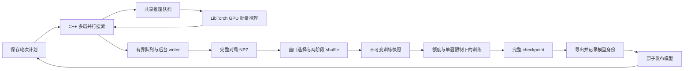

# 运行框架与数据链路

本文说明 AlphaZero 与 MuZero 共用的逐轮运行管理和数据基础设施。下述真实棋盘搜索与单状态数据布局属于 AlphaZero；MuZero 的独立 latent 推理、序列布局和训练差异见 [MuZero](muzero.md)。算法语义见 [algorithms.md](algorithms.md)，Gumbel 的独立搜索策略与目标适配见 [Gumbel](gumbel.md)。

## 参考来源与边界

主要并行架构与训练数据管线参考 KataGo：对局线程共享 evaluator、多推理服务、NN 缓存、原子搜索统计与 mutex pool、有界后台写盘、二进制观测打包、NPZ 文件边界、power-law 回放窗口、随机分桶再桶内洗牌与 multi-wave，以及训练文件预取。源码提交、入口和校验值见 [reference_sources.json](../reference_sources.json)，许可证与改编范围见 [THIRD_PARTY.md](../THIRD_PARTY.md)。平衡开局直接参考 KataGomo；冷启动记账、Renju 与 TorchScript / LibTorch 边界另参考现有 MuZero_V2。

当前采用逐轮编排：按基准训练量与 replay ratio 规划 selfplay，实际训练量受新增数据额度和快照单遍限制。KataGo 的同步脚本同样顺序执行阶段，learner 使用额度桶、no-repeat-files 和 epoch/subepoch；本地额度在整轮提交时结转，阶段恢复沿用保存的实际预算，没有常驻异步阶段推进或局内换网。V0 的历史来源对照及验收证据见 [E01—E26 核查记录](../../EtaZero.md#engineering-audit) 与 [实施记录](../../plan.md)，不作为 V1 当前实现或新增能力的验收结论。Go 专有监督的映射和辅助 heads 见算法文档，不能由执行架构推定支持范围。共享架构不表示已有相同的吞吐、后端优化或训练效果。

## 执行架构



### 对局、搜索与推理

[原生命令](../cpp/src/commands/main.cpp)为每个 worker 建立一个模型服务和多个对局线程。每局独立持有状态、搜索图和随机流，对局共享 evaluator。[Search](../cpp/src/search/search.cpp) 为每局保留搜索线程，逐手派发任务；单线程使用同一实现。

节点展开由共享 mutex / condition-variable pool 协调，以 release/acquire 发布合法动作先验与 child 统计。合法动作全部保留，child 统计按 8、64、全部合法动作三档按需增长；选择扫描已激活 child，并通过排序先验求出未访问动作的最大分数和全部并列候选，不裁剪动作域。节点累计访问与在途数直接参与 PUCT，避免每次扫描全部合法动作求和。每个搜索线程复用状态、路径和候选暂存，AlphaZero 状态按原位复制重置。边分别保存完成访问和在途预约，图节点统计在多父之间共享；virtual loss使用共享子节点在途数，仅参与调度。回传或来源定义的访问追赶完成后增加正式访问。失败释放全部预约，搜索返回前等待该手全部任务结束，访问／playout 严格发放预算；时间或显式停止时允许少于额度返回，已在途路径完成后释放所有 pending。

对局线程跨对局复用 Search 和搜索线程，重置图与随机流。节点表拥有全部节点，根推进时复制统计及边并保留共享后继。停止所有搜索线程后标记根可达节点，未标记节点各自移交一个删除链表；大图使用已有搜索线程并行回收。标记阶段使用可达集合与队列，析构只删除本节点，不递归访问共享边。并发选择可能读取不同时间的原子统计并改变搜索顺序；单线程 PUCT 与动作并列时的抽样定义不变。

[BatchEvaluator](../cpp/src/inference/batcher.cpp) 的请求具有唯一身份、模型身份和固定输入形状。入队采用 KataGo `forcePush` 语义，不因超过名义 `queue_capacity` 阻塞；调用者入队后等待自己的推理结果。每个 evaluator 固定绑定模型、画布和推理精度，多个服务共同消费队列。服务数由 `inference.server_threads` 指定，设备由独立 worker 的 `devices.selfplay` 项确定。默认立即取队列最多 N 项；非零 `batch_wait_us` 可显式增加等待期限，属于性能和调度条件。关闭后拒绝新请求并排空已入队请求；失败唤醒当前批和队列内调用者，后续调用直接报错。

[TorchBackend](../cpp/src/inference/torch_backend.cpp) 为每个服务建立独立 CUDA stream，复用 pinned host 和 device 输入缓冲区。模型加载一次并共享只读权重；selfplay 的 FP16 在加载时按 autocast 的舍入准备 Conv/Linear 权重，归一化参数与 buffers 保持 FP32。所有后端串行初始化完成后才启动服务线程，避免 CUDA Graph 捕获与其他服务的 CUDA 工作重叠。准备完成后同步加载 stream，再允许其他服务使用权重。批量前向后一次回传普通/optimistic policy logits、WDL 概率和误差标准差；检查模型契约、画布、输出形状和数值。LibTorch 来自训练使用的同一 PyTorch 环境。多个服务共享模型权重，各自的输入缓冲与工作区仍需要额外显存；同卡并发不保证吞吐更高。

CUDA 推理按 batch 1、2、4 等大小直到 `inference.max_batch`（包括非二次幂上限）预热并捕获前向、WDL softmax 与输出打包，运行时选择能容纳真实请求的最小 Graph。不足一批的部分重复首个有效输入及全局特征；导出网络的 evaluation normalization 按样本独立，补齐行不会进入搜索、缓存计数或训练轨迹。每个服务独立持有 Graph 与其固定地址的输入/输出；一次阻塞回传完成后才复用缓冲区。换网或 release 时随整个 evaluator 销毁并重新捕获，不跨模型复用。CPU 使用普通前向。预热和捕获计入模型准备耗时及所在 selfplay 阶段墙钟，并占用额外显存；Graph 不改变推理精度设置，batch 大小变化仍可能改变 CUDA kernel 的浮点舍入，不能保证所有并行轨迹逐位一致。

同步 evaluate 调用期间，调用者持有原始观测与 D4 变换后的暂存直到结果返回；线程复用请求、等待条件、变换观测与 cache key 缓冲，服务线程复用 batch 暂存。evaluator 按固定画布预计算八个 D4 映射。CPU 上变换空间输入，再填入 pinned 缓冲；输出还原 canonical 坐标后缓存。结果一次回传 FP32 后转换到公共搜索数值类型。

SP 的 `inference.inference_precision` 明确选择 FP32 或 FP16 autocast，baseline 使用 FP16。analysis/match 支持 `auto`，当前 LibTorch 实现按明确指定的 CUDA 设备解析为 FP16、CPU 设备解析为 FP32；原生结果记录实际精度，显式 FP32 override 保留。FP16 仅适用于 CUDA，归一化仍显式累积 FP32，输出 head 必须实际使用 FP16；训练 AMP 由另一项配置独立决定。导出文件保存 FP32 权重，每轮导出不执行推理数值对照；数值正确性由独立测试验证。该后端仍使用 TorchScript / LibTorch，没有移植 KataGo 的专用 CUDA/cuDNN 算子后端。

单朝向默认随机 D4，cache 命中保留首次输出且不推进朝向 RNG；指定朝向覆盖未命中请求的默认随机行为；已有 cache 仍复用首次输出，绕 cache 才强制实际朝向。根多对称请求绕过缓存读写；raw 诊断指定 identity 并绕缓存。服务的朝向 RNG 独立于搜索与落子 RNG，共享服务请求次序仍依赖线程调度。

NN 缓存采用有界直接映射表与分段锁，保存不可变原始主/短期 optimistic logits、WDL 概率及误差标准差。键比较变换前五个二进制空间平面的全部位、六个全局浮点特征的原始字节、NN policy 温度及有效 optimism，朝向不入键，包含棋盘尺寸、Renju 执色、棋规和禁手特征开关；哈希只用于选槽，碰撞不会返回其他输入的结果。模型与精度由 evaluator 生命周期隔离。`inference.cache_entries = 0` 显式关闭缓存，空间输入必须为二进制，全局特征允许 Renju 黑方的 -1。缓存不合并同时在途的相同请求，也不缓存根噪声或搜索策略。optimism 使用精确 double 字节分键，无辅助能力时归零；根/叶条件刷新及标准差到统计权重的转换见 [搜索修正](algorithms.md#误差加权optimistic-policy-与-noise-pruning)。Backend 声明的辅助能力须与实际输出一致，多服务必须使用同一能力契约。原生 analysis 同时输出 network_sample_weight、network_value_stdev、search_weight 和 search_weight_sq，用于区分访问数和加权统计。

公共搜索遍历通过 [SearchState](../cpp/include/etazero/algorithm.h) 获得状态复制、动作域、转移、叶评估、终局值、奖励、折扣与视角转换。AlphaZeroState 提供真实棋盘适配；公共遍历不自行调用五子棋规则。支持图共享的状态还须提供包含 continuation 与 NN 输入条件的完整 `graph_key`；不支持时明确拒绝。MuZero 使用独立 latent 搜索实现，按实际语义复用数学函数，见 [MuZero](muzero.md#网络与推理)。

### 轮次与设备

[Python 控制器](../python/etazero/runtime.py)依次执行 selfplay → shuffle → train → export。阶段内部保留对局并行、树内并行、后台 writer、shuffle worker 和文件预取，Shell 只负责薄启动。

bootstrap 为 iteration 0，只执行 selfplay，不 shuffle、不训练、不导出初始网络。iteration 1 补足有效训练行并完成首轮训练发布；后续四个阶段合为一次 `iteration`，完成模型发布与状态提交后才增加迭代编号。`.internal/state.json` 的 `iteration` 从 0 开始，表示当前未完成或下一次待处理的迭代；初始化 checkpoint 的迭代编号为 0。`.internal/iterations/<编号>/` 保存计划、阶段状态和 learner 进度，原始分片保存到 `selfplay/iteration_<编号>/`。checkpoint 的 `step` 是迭代内消费的 batch 数，`total_steps` 跨迭代累计消费；`total_samples` 包含 AMP 跳步消费，`optimizer_steps` 单独累计成功更新。`run.max_iteration` 是整个运行的累计完成目标，0 表示无限迭代；`--iterations` 可临时覆盖目标，时间限制与停止信号仍有效。

`devices.selfplay` 每个列表项启动一个独立 worker，记录设备、worker 身份和种子；可以指定多个 GPU，或同一 GPU 上的多个进程。learner 使用 `devices.train`，当前为单卡训练。没有 DDP 或跨机器调度。

worker 随机流从运行种子、iteration、持久化 attempt 序号和 worker 身份派生，产物 UUID 只负责文件身份。同一配置的独立运行具有一致的 worker 种子，重试使用新序号。实际每局种子随轨迹保存，树内并行调度仍可能影响访问顺序。

每轮使用计划中固定的输入模型，新模型发布后，下一轮才换代。[常驻 worker](../python/etazero/native.py) 按请求处理 bootstrap 与补局。随机阶段使用 CPU RandomBackend 经过共享队列与正常搜索，无模型前向或 CUDA 推理分配；每次 attempt 的随机输出由其种子和完整观测决定，不依赖服务线程调度。网络阶段在同一生产阶段复用模型服务和 CUDA 上下文；每次请求仍使用独立 attempt 目录和记录。在进入 shuffle / train 前排空推理、销毁 CUDA Graph 与推理缓冲，将共享模型移回 CPU，再释放 CUDA allocator 缓存。worker 保留已准备的 JIT 执行结构；下一轮读取新模型，结构与精度一致时替换全部权重和统计缓冲并重新捕图，结构改变时重新准备。正常停止阻止新局并取消半局，在途搜索收尾后 writer 排空已完成对局；半局不会写成和棋。控制器退出关闭 worker 输入并等待其退出。

常驻进程仍保留 CUDA 上下文的固定显存开销；训练显存预算须计入该开销。GPU 模型权重、推理输入和 allocator 缓存随 release 请求释放，CPU 模型与 JIT 状态保留。

### Selfplay 并行参数短测

[benchmark_selfplay.py](../scripts/benchmark_selfplay.py) 使用指定配置和固定网络权重逐项测量完整 selfplay 请求，包括平衡开局、主局、side 搜索与后台 writer 排空。每组参数使用独立常驻 worker，先预热，再以相同局数和种子序列测量；NN cache 与 fork pool 按生产 worker 的生命周期保留。模型加载和首次 JIT 执行包含在预热中，不计入测量。产物写入新的独立目录，不进入训练回放。

```bash
conda run --no-capture-output -n pytorch python scripts/benchmark_selfplay.py \
  --config-dir configs/minimal_test --model /absolute/path/to/model.pt \
  --output data/selfplay_benchmark_new --games 1024 --warmup-games 128 --repeats 2 \
  --candidates 32:32:1:1:0 128:128:1:1:0
```

候选项依次为 `game_threads:max_batch:server_threads:search_threads:batch_wait_us`。模型须符合当前输入契约和配置画布；`--evaluator random` 可省略模型，用于单独检查冷启动，此时每个请求重建随机服务，与生产行为一致。GPU 不可见的托管沙箱须在可访问宿主 CUDA 的执行环境运行。比较时保持网络、访问预算、棋规和采样参数一致，优先看完整请求的训练行／秒与局／秒，并检查局长及采样量波动。`simulations` 只统计主局逐手搜索，不含开局和 side 搜索；其吞吐用于辅助区分工作量变化。所有棋局完成后才结束计时，因此包含批次末尾并行度下降的耗时。

输出保留生效配置、源码快照、二进制和模型校验值、硬件与依赖、原始事件及 NPZ，并记录实际平均 batch、cache 命中率、排队时间与每秒采样的 GPU／内存指标。资源采样自身有少量开销；这是 selfplay 短测，不是完整训练轮性能或棋力结论。改变并行度会改变请求、随机 D4 和 fork pool 的调度顺序；提高树内线程数还会改变搜索访问顺序，须作为实验条件变化记录。

## 配置组织

每套配置位于 `configs/<name>/`。训练使用 `run.cfg`、`env.cfg`、`net.cfg`、`selfplay.cfg`、`train.cfg`；`env.cfg` 的 `[environment]` 管理棋盘、规则和训练行的禁手特征 dropout；`hex` 使用普通六邻接实际连接规则。`selfplay.cfg` 的 `[hex_opening]` 配置 Hex 首手平衡采样，与五子棋 `[opening]` 独立，详见 [Hex](hex.md)。`selfplay.cfg` 首部 `[search]` 集中完整／cheap 根访问预算、cheap 概率与权重；搜索技巧按独立 section 配置，底部 `[parallelism]`、`[inference]`、`[writer]` 管理执行资源。训练字段以 [config.py](../python/etazero/config.py) 为事实源。独立分析和比赛通过 `analysis.cfg`、`match.cfg` 显式引用公共 `engine.cfg`，字段以 [engine_config.py](../python/etazero/engine_config.py) 为事实源，不读取训练继承链，不参与训练配置身份；引用、覆盖优先级与直接文件入口见 [分析与比赛配置](elo.md#独立配置与搜索预算)。

派生配置在 `run.cfg` 的 `[run]` 中使用 `extends = baseline`，父目录名优先在所选配置的同级解析，找不到时在本版本 `configs/` 下解析，因此实验伞目录中的臂也可直接 `extends = baseline` 或 `minimal_test`。解析次序是父配置、当前配置、当前目录的 `*.cfg.local`；父目录本机覆盖不向子配置传播。继承循环、父目录缺失、未知/重复字段、错误文件归属、非法枚举与范围、非法组合或未实现能力，均在启动 worker 前失败。

`run.run_dir` 可省略或留空，且不继承父配置。最终输出位置按 `--run-dir`、当前目录 `run.cfg.local`、当前目录 `run.cfg`、自动映射的优先级解析；本机覆盖中的空值恢复自动映射。默认将所选目录相对于本版本 `configs/` 的完整路径映射到 `data/`，例如 `configs/<伞目录>/<臂名>` → `data/<伞目录>/<臂名>/`。配置中的相对输出路径以本版本目录为基准，命令行中的相对输出路径以调用时工作目录为基准；最终路径解析符号链接并保存为绝对路径。`configs/` 外的配置必须显式指定输出位置，父配置中的输出位置不能满足这一要求。`check-config` 支持 `--run-dir` 并显示解析结果；同一最终路径的自动选择与显式指定生成相同配置身份。历史产物不自动迁移，恢复检查模型、优化器与数据消费所需条件，输出路径与执行资源不绑定训练身份。

Python 保存完整生效配置及其 SHA-256 身份，生成 C++ 消费的 `config/effective.cfg`，C++ 不维护第二套默认值。观测、动作、模型输出与原始分片类型由 [schema.py](../python/etazero/schema.py) 定义，构建时生成 C++ 头文件，模型和数据记录契约内容校验身份。

恢复核对模型结构、算法、优化器和训练数据消费条件；CPU 线程、设备、预取、编译、checkpoint 保存频率和运行上限可以调整。完整初始配置保持在 run 记录，每次执行的配置另存 `config/sessions/`，当前 `effective.json` 和 native 配置按本次解析结果生成。改变执行资源或编译方式属于实验条件变化，应在等时间比较时说明。

## 运行目录

| 路径 | 内容 |
|---|---|
| `config/effective.json`、`config/effective.cfg` | 完整生效配置及 native 输入 |
| `logs/` | 原始事件日志、worker stdout/stderr |
| `selfplay/iteration_<编号>/` | 按 attempt 与 worker 分开的完整对局 NPZ |
| `snapshots/` | 不可变 shuffle manifest 和可重建训练 payload |
| `checkpoints/` | 最近若干轮末及当前未完成轮的完整训练状态 `.pt`；活跃索引位于 `.internal/checkpoints.json` |
| `models/`、`models/current.json` | 已校验推理模型和发布指针；首轮训练前无已发布网络 |
| `training.png` | 每轮提交、正常退出和恢复后自动重建的训练图；也可手动重绘 |
| `loss.png` | 总 loss 与每项实际启用的损失分量，逐面板对照训练均值与轮末验证均值 |
| `logs/performance.png` | 阶段耗时、吞吐与推理统计 |
| `logs/iterations/` | 与整轮提交对应的指标、累计训练时间和模型身份 |
| `.internal/discarded/` | 不参与训练或图表的中断轮原始产物 |
| `.internal/` | run/state/session、锁、iterations、catalog、training_views 和 source 源码证据 |

原始对局、历史推理模型和提交记录保持不可变；训练状态 `.pt` 按 checkpoint 保留策略回收，派生缓存集中存放不影响恢复与快照重建。新配置与轨迹契约不提供旧格式兼容，已有历史目录不会被自动迁移或覆盖。

## 数据链路

### 原始对局分片

[RecordWriter](../cpp/src/selfplay/record.cpp) 经有界队列接收完整对局，按随机取整后的最终训练行数写压缩 NPZ。一局按主局重复行、side重复行的顺序写出，可以跨文件拆分。首文件阈值采用来源公式 `maxRows-int(maxRows*(1-minProp)*U)`，`U` 均匀取自 `[0,1)`；`writer.first_file_min_random_proportion` 对应 mainb18 的 `firstFileRandMinProp`。后续满片恰好包含 `writer.shard_rows` 行，不按定时器提前发布；退出排空队列并发布未满尾片。数组在 flush 后复用，轨迹存储可随稀疏采样增长；不使用 pickle 对象数组。

空间观测为 `uint8[N,5,ceil(canvas²/8)]`，独立的 `globals` 为 `float32[N,6]`，各平面按行优先顺序使用高位在前的 bit packing，最后一个字节的多余位必须为零，与 KataGo 的 packBits / NumPy unpackbits 位序一致。压缩 ZIP 时直接流式读取数组，不构造另一份完整 NPY 字节串。

每局保存 T+1 个观测和行棋方、T 个动作与奖励、新增模拟数、行为温度、真实终局与原因，以及尺寸、棋规、种子和唯一对局身份。T 包括所有开局动作；`train_mask` 的前缀为零，前缀 simulations/temperature 为零。另保存 opening/balanced/policy moves、attempts、status、后继视角 start value 与失败原因。每步保留轻量的 network/search WDL、cheap 标记、policy/value surprise、期望 target weight 和实际 `row_repeats`，用于审计完整对局及权重计算。轨迹观测保留完整禁手提示；writer按每个最终重复行独立抽样，另存 `forbidden_input:uint8[rows]`，训练视图展开后同步应用到两禁手平面及全局开关；重新shuffle不改变这些决定。

大数组 `policies`、`opponent_policies` 和 `visits` 与完整轨迹分别索引：仅保存 `sample_indices = flatnonzero(row_repeats > 0)` 指定的位置，shape 为 `[S,canvas²]`，S 是采中的不同位置数。每个位置只存一次，训练视图按采样次数展开。过滤发生在 surprise weighting 和随机取整之后，能保留重新获得权重的 cheap 搜索；零权重 full、cheap 以及开局均不保存独立训练行；零采样搜索仍可作为前一手的 opponent 目标随前一手保存。policy 使用最终选择权重的 int16 确定性量化，visits 保持 int64；归一化顺序见 [训练目标](algorithms.md#学习与数据使用)。另存 `[S]` 的 `opponent_policy_weights`，终局手及显式不使用 outcome targets 的 reanalysis 行为零；后继目标在 C++ 完整对局尚在内存时提取，shuffle 不依赖后继手也被采中。对局与采样数组在同一 NPZ 内原子发布，避免两个文件交接不完整；未采中位置的 visits 不再支持事后恢复。

分片保留所涉及棋局的完整轨迹和搜索数组，跨片棋局会在相邻分片重复携带上下文。元数据 `row_begin` 与 `rows` 指定本片在这些棋局的完整最终训练行序列中实际承载的区间 `[row_begin,row_begin+rows)`；只有该区间进入训练。先用完整轨迹计算 TD 和 opponent 目标，再取区间，禁止将分片末尾当作终局或重新抽取重复频率、dropout、Q量化。`plies` 和 `games` 描述本片携带的轨迹，不能跨片直接相加当作唯一局数；catalog 的唯一统计见下文。独立 policy init 若已结束整局，仍保留零训练行的轨迹证据。分片元数据关联 run、iteration、worker、attempt、配置、源码与输入模型。

先写同文件系统的临时文件，flush、fsync 后重命名，再 fsync 目录。每次 worker 启动使用新的 attempt 目录，拒绝覆盖已有输出；读取只消费已发布的 `.npz`。写入错误唤醒生产者并传播失败。正常信号收尾会发布已完成对局的未满尾片；SIGKILL 或断电可能丢失队列和缓冲中尚未发布的训练行及轨迹。

主局另存 `reanalyzed`、`reanalysis_used_outcome`、`reanalysis_original_visits`、`reanalysis_policy_surprise` 和 `reanalysis_value_surprise`。重分析只替换所选 cheap 手的训练搜索数组及轻量 NN/search WDL，不修改真实轨迹；原始预算/选择信息单独记录，surprise 在替换后重算。opponent 可用性同时检查末手和 outcome-target 开关。PDA 主局 flag 和 signed-half-d 在相邻玩家间翻号且全局保持同一优势；完整轨迹保留它，禁手 dropout 只修改原禁手字段。历史不符新契约的数据/模型直接拒绝。hint/fork在`initial_position_kind`单独标记ordinary/hint/earlyFork/gameFork/hintFork（0…4），`hint_actions`为canvas编号或-1。总prefix为balanced+policy+initial；initial prefix与开局搜索互斥，无搜索/频率监督，fork必须PDA0。

[读取与检查](../python/etazero/data.py)正常链路核对类型、形状、offset、采样索引和训练行区间；显式 `read_raw(..., deep=True)` / `validate_raw` 另外核对交替视角、逐手棋盘、mask、访问数、策略与奖励。AlphaZero WDL 目标由终局结果和该状态行棋方派生为 W/D/L one-hot。训练视图展开各棋局的主局及side重复行，再按本片区间选择。SQLite catalog 可从原始分片重建；按 run/attempt/worker/game 身份核对轨迹指纹与总训练行数，拒绝重复或重叠区间，逐区间累加实际行数，局数只计一次。胜和负、完整局长和开局统计归属于包含该局第0个训练行的分片，零行棋局单独保留，跨片上下文不会重复计数。启动时扫描历史产物，运行中仅扫描当前 iteration；开局前缀不进入训练行数。近期窗口按实际文件mtime从新到旧选完整片，不用未选中的上下文行抵扣窗口或产样quota。

原始搜索Q目标随所有架构保存，启用Q的learner才计入loss。`q_visits`为int16[S,A]，S对应`sample_indices`的正采样位置；`q_values`为int16[R,A]，R为主局最终重复输出行数，对应`forbidden_input`。访问数按位置压缩，Q随机量化按输出行独立保存，重复行可以不同。side对应`side_q_visits` [D,A]及`side_q_values` [R_side,A]，零重复side仍保留访问数而没有Q输出行。启用 Q 时训练视图生成float32[N,A]的Q值（除32000）与访问数；D4、shuffle、reader与预取保持两者和观测配对。源契约由[schema.py](../python/etazero/schema.py)唯一维护，旧契约明确拒绝。

独立 `side_*` 数组保存关联主局索引、观测、玩家、policy、visits、搜索 WDL、频率和逐输出行提示决定。side 搜索未走到终局，完整主局标志和 opponent 权重为零，主 value/三个 TD 均取自身搜索 WDL。统计 rows 包含普通及 side 的重复行，plies/games 仍仅指实际主局。side 由真实 SP 替代着和回复/替代着递归产生；PDA 两个全局量始终为零，writer 会拒绝非零条件。开局前缀不充当 side。

### 窗口与 shuffle

训练派生视图仅生成已启用 loss 所需的目标；关闭 Q head 时，不转换、shuffle、解压、D4 或上传 Q 值和访问数。MuZero 关闭辅助 loss 时仅生成主 policy 与终局 value，保留展开权重、序列 mask 和吸收态标志。原始对局继续保留全部目标。manifest 与视图缓存身份记录实际目标集合；资源规划保留完整目标的保守估计，避免改变分组、分桶、采样舍入或随机流。

正常运行以 catalog 的累计原始／随机行数计算窗口，只查询并处理实际窗口中的分片，复用已入库的文件 mtime；完整历史文件核对在启动与恢复时执行。

[shuffler](../python/etazero/shuffle.py) 使用 KataGo 的 power-law 窗口。窗口累计 `N = min(random_rows,m) + postrandom_rows`，random身份来自原始数据的 `model_id = random:seed`（判断前缀`random:`）；该封顶只用于窗口，不改变真实累计产样和quota。按文件实际mtime从近期向前选择完整分片至窗口阈值，最后一片允许超额。相同mtime按catalog稳定输入顺序打破平局，不声称复现来源文件系统遍历顺序。

令 `s = taper_scale`（0时取m）、`d = add_to_data_rows`、`x = N−m+s+d`，窗口为 `max(m, int(m + a·(x**p−s**p)/(p·s**(p−1))))`，设置 `max_rows` 时再截到上限。参数和非法范围由 [train.cfg](../configs/baseline/train.cfg) 与 [config.py](../python/etazero/config.py) 唯一维护。快照另存来源范围 `[raw_total+int(d)−actual_window_rows, raw_total+int(d)]`；其end是未封顶的真实累计，不能替代N或本地产样quota。

`keep_target_rows` 接受正整数或 `all`。在MD5切分之前计算 `q = min(1,K/actual_window_rows)`；窗口文件先乱序，再累计训练行到 `group_rows` 阈值才封组，末文件可以跨阈值。每组保留 `round(group_rows_actual·q)` 行的均匀子集，取整采用Python round，包括半整数的偶数取整；因此总输出可能偏离K。`q=1`保留全部，`q=0`的空结果明确拒绝，不能用旧快照顶替。

两阶段shuffle对保留行独立均匀分桶，再按固定计划的桶数和每桶文件数输出：`B=max(1,round(approx_rows_per_wave/bucket_rows))`，`F=bucket_rows/training_shard_rows`，要求整除；真实桶内按 `floor(j·N/F)` 等分。training_shard_rows是名义大小，真实文件可更大、更小或空，不根据实际桶大小重新决定F。所有字段共同排列。source的均匀排列＋multinomial桶计数与该随机分配分布相同；这里使用可重建的独立SeedSequence流，不宣称来源os.urandom序列相同。初次采样、wave内scatter和merge分别使用含partition/stage/wave/group/bucket的命名空间，跨桶任务不复用流。

来源shuffle CLI默认 `min_rows=250000,p=1,a=1`，K必填，group80000、输出70000、桶默认等于输出；`selfplay/shuffle.sh` 显式使用 `p=.65,a=.4,K=20000000`，普通分支MD5留出1%，SKIP_VALIDATE分支全作train。`synchronous_loop.sh` 还覆盖m100000、s50000、K600000并设置SKIP_VALIDATE=1。EtaZero的窗口、保留目标与本机shuffle资源参数以 [train.cfg](../configs/baseline/train.cfg) 为准；项目配置可参考 [KataGomo shuffle profile](/home/sky/RL/SkyZero/KataGomo/python/shuffle.sh:49)，具体窗口、验证开关和资源数值由所选配置确定。本地采用训练额度与单遍快照限制；同步示例中的具体训练数量不是本地配置默认。
首次消费原始分片时检查字段、dtype、shape、offset 和行区间，在 `.internal/training_views/` 保存 DEFLATE level 1 压缩的紧凑训练视图。缓存使用契约、原始 shard 身份与实际目标集合定位，不维护认证证书，不在命中时重新扫描文件哈希。原始分片保持不可变，缓存不代替轨迹；损坏 NPZ 由读取器明确报错。已离开当前窗口的视图在本轮提交后回收。

`shuffle.waves > 1` 先在输入组中完成一次采样，将保留的每行独立均匀分配到一个 wave，再逐 wave 执行两阶段 shuffle；第二阶段不重复采样，完成后立即删除该 wave 的临时文件。额外 I/O 换取更低的同时存活分桶文件数量，不改变已选样本集合。

`[shuffle]` 管理 worker 数、组/桶/训练分片行数、wave 数、内存、临时目录与快照保留数。`shuffle.memory_mb` 为全部 worker 的数组内存规划预算。按实际观测、policy、visits 布局估算，必要时在采样前确定有效组阈值及桶名义行数；桶保持名义输出行数的整数倍，组估算允许完整末文件超额。不能容纳一个完整原始分片或名义训练分片时，在开始写入前报错。实际随机桶超过数组预算时明确失败，要求扩大内存或减小桶名义大小，不递归再散桶改变输出计划。该估算不包含 Python 进程、分配器与 OS 开销，不是进程 RSS 的硬上限。快照 manifest 和 `shuffle_resources` 事件记录有效行数限制、采样比例、输出行数估算、数组内存、临时磁盘与文件数量估算。磁盘容量在开始前核对，随机波动、压缩开销和外部磁盘使用仍可能使实际值不同。

`shuffle.temp_dir` 可指定独立临时目录，空值使用 snapshots 所在目录。每次尝试使用唯一私有工作目录，`shuffle.compress_temp` 默认启用 DEFLATE level 1；关闭时使用未压缩 NPZ，适合空间充足且压缩 CPU 成本受限的场景。该开关覆盖 wave、scatter 的中间文件，不影响持久化视图缓存的压缩。中间文件不哈希、不 fsync；可重建视图缓存以原子 replace 发布，不逐文件 fsync；最终训练文件采用 DEFLATE level 1，并持久化后发布。压缩不改变数组、采样随机流或最终训练数组；磁盘预估采用未压缩容量，只提示不据此拒绝运行；实际写入失败明确报错。正常完成或异常退出清理本次临时目录，原始分片保持不变；SIGKILL/断电可能留下未发布目录，需要删除对应的 `.shuffle_*` / `.tmp_*` 目录后重建。

全部文件与 manifest 在临时目录准备，记录来源 shard 身份、随机种子、窗口行数与输出行数，完成后原子发布整个快照。learner 持有本轮快照，不混读不同代次。

`shuffle.snapshot_keep` 限制保留完整 payload 的已完成快照数量，其余只回收可重建的 `data/`，保留 manifest、配方、原始对局与 checkpoint。读取被回收快照时，在文件锁内用原来源、随机种子和资源计划恢复相同采样，核对文件名与行数后原子发布；无需反复计算全文件 SHA-256。当前未完成轮的快照不会被回收，旧配方重建主要用于显式读取历史快照。原始对局不按此配置删除。

[BatchReader](../python/etazero/reader.py) 预取当前文件及depth个后续文件，保持紧凑布局，仅解包当前batch。每文件只读取 `floor(rows/batch_size)·batch_size` 的前缀，尾部丢弃；低于batch的文件不供给样本，也不与其他文件凑batch。manifest记录每pass完整batch数、可消费行数和尾部丢弃行数。

learner 固定单遍消费：随机排列文件，每个文件在本轮快照中最多读取一次。训练预算在 shuffle 后按 manifest 中的完整 batch 数确定，恢复沿用已保存的预算和消费游标；预算与剩余 batch 不一致时，在更新前报错。reader 的独立 repeat 模式保留用于来源对照，训练入口不启用，也不提供配置开关。历史原始样本可以在后续轮次的新快照中再次被选中。切换快照只发生于下一同步轮；来源的目录轮询、新文件队列插入和20目录历史不适用于持有不可变单轮快照的本地协议，不能称已实现常驻异步generator。

后台batch队列和CUDA上传stream有界。每batch携带消费游标，包括文件order、已结束文件、文件/行位置、pass、RNG、repeat模式、split与batch大小；checkpoint取已消费游标，包含AMP skip。源generator在pop文件时记用过，本地额外保留文件内游标以恢复后续完整batch。未消费的预取可丢弃重读。两个pinned槽通过event防止DMA覆盖，record_stream保证GPU生命周期。

`training.skip_validation` 控制验证；true 对应同步来源 SKIP_VALIDATE 分支。启用时MD5原始文件basename的前13个十六进制字符除2**52，`[0,.99)`作为train，`[.99,1)`作为validation；目录和模型代次不影响所属分区。writer以独立OS随机流生成64位十六进制basename，不消耗game RNG。两分区共用原窗口与切分前q，分别按来源分桶规划，manifest持久记录源文件分区与输出文件行数。验证payload位于同一个原子data目录的validation子目录，回收及重建同时覆盖两个分区。

每轮训练结束、最终checkpoint之前，validation用当前raw模型eval/no_grad读取每文件完整batch，默认按文件名排序；`randomize_validation_files`可随机文件顺序。验证始终随机D4，即使训练D4关闭；采用独立随机流，保持训练RNG不受验证影响。AMP精度及FP32 heads沿训练设置，启用compile时单独生成eval图。`max_validation_samples=0`不设上限，正值在完整batch使总数超过上限后停止，沿来源允许一batch超额。验证不推进optimizer、Lookahead、SWA、训练样本或成功更新计数，不修改BN统计；无完整validation batch时明确记录samples=0，不捏造loss。事件记录样本均值loss、batch数量和D4计数。此验证不是棋力评估。
## 训练额度与自对弈产量

`training.train_steps` 是产样规划基准与单轮训练步数上限。`training.replay_ratio` 是每新增一行 selfplay 有效数据获得的训练样本消费额度；重复 shuffle、降采样和窗口淘汰不改变产样计数。每次训练最多遍历当前快照一遍。

冷启动分为两个阶段：iteration 0 完成 `bootstrap_games` 局随机评估搜索，只测量有效行数／局，不训练；iteration 1 按实测均值估算 `min_rows` 缺口，实际不足就继续补完整局，直至达到门槛。两阶段均跳过网络平衡开局与 policy init，仍执行正常搜索和真实终局监督。首轮训练步数为基准上限与快照完整 batch 数的较小值。首次训练发布时保存实际累计行数 `replay_origin_rows`，冷启动产样不发放正常阶段的训练额度。

正常阶段（iteration >= 2）：

```text
S = training.train_steps
B = training.batch_size
R = training.replay_ratio
C_start = 上一轮提交时的实际累计有效行数（replay_rows）
N_target = S * B / R
rows_per_game = 前两个已完成 iteration 的有效行数之和 / 对局数之和
games = max(1, ceil(N_target / rows_per_game))
N_actual = 本轮结束时的实际累计有效行数 - C_start
available_credit = 上轮剩余 train_credit + N_actual * R
P = 当前快照每个训练文件 floor(rows / B) 之和
actual_steps = min(S, floor(available_credit / B), P)
remaining_credit = available_credit - actual_steps * B
```

历史均值按局数加权；不足两轮时使用已有轮次。rows 包含主局与 side 的实际重复行，零行对局计入局数，跨分片对局只计一次。正常轮完成估算的局数后进入 shuffle，不再反复补齐行数目标，也不把行数欠产累加到后续轮次。长短对局变化由实际训练预算吸收；整局超额产生的训练额度保留供后续轮次消费，但单轮仍受 S 与 P 限制。

例如基准 2000 步、batch 128、ratio 8，计划新增 32000 行。没有旧额度时，实际产出 16000 行最多训练 1000 步；若快照只有 700 个完整 batch，则训练 700 步，剩余 38400 个样本消费额度结转。额度允许非整数，不强制最少训练一步；不足一个完整 batch 时完成零步轮次，保留模型、checkpoint 与额度，不重复导出模型。

计划在 selfplay 前保存，包含起始累计行数、基准预算与旧额度；中断恢复只补足原计划的剩余完整局数。shuffle 后，实际步数、快照完整 batch 数及可用额度随现有阶段状态保存；恢复训练不重新发放额度，也不重新决定步数。新剩余额度只在整轮提交时生效。未实际更新的 AMP overflow 仍消费一个 batch，不重试。日志中的累计实际 ratio 为累计训练消费量除以累计有效行数，包含冷启动，不能与正常阶段的训练额度直接等同。

`training.sub_epochs` 把实际训练预算划为非空本地分段；实际步数少于配置段数时减少段数，边界为 `floor(j*actual_steps/actual_segments)`。分段入口只重置 Lookahead 周期与分段计数，保留 fast/slow、SWA 及全局消费状态。LR/WD 和范数打印仍沿实际 batch 时钟；validation 和 finish_round 在实际轮末执行。`swa_period_samples=0` 的周期仍由基准 S 推导，跨轮累积，不随临时产量波动。

预算计算使用已有 catalog 计数和快照 manifest，不重新遍历样本、不增加 batch 内操作，也不创建额外后台任务。轮次变短可能增加 shuffle、导出和绘图等固定开销的占比，不能把预算计算的低开销等同于端到端训练效率不变。

每轮计划锁定input_model_id，所有实际主局和side沿用该输入。全部产样请求完成后才对各worker做release握手，再进入shuffle/learner；日志记录PID、输入模型与释放时点。worker跨轮存活，模型ID或模型路径变化均重建evaluator/cache，避免同ID不同权重串用；不实施局内轮询换模型。

## 模型发布与恢复

[learner](../python/etazero/training.py) 实现实际预算内的单遍消费、batch 级 D4、SGD / AdamW、分组 LR/WD、warmup、范数自适应衰减、Lookahead 与 SWA；配置入口在 `train.cfg`，数学与适配边界见 [学习与数据使用](algorithms.md#学习与数据使用)。非有限 loss 或无法恢复的非有限梯度明确失败；FP16 缩放溢出按下述机制跳步，消费与成功更新分别计数。

`training.compile` 将网络与完整损失联合交给 torch.compile / Inductor，使用 fullgraph 和静态 shape 捕获：learner 的 batch 大小与画布固定，各网络结构、尺寸与精度使用各自的图。超过重编译限制时明确失败，避免长运行静默退回 eager；首次 shape / 精度编译有额外耗时。公共包入口在导入 PyTorch 前设置持久缓存，默认 `${XDG_CACHE_HOME:-$HOME/.cache}/etazero/compile-v1/{inductor,triton}`，尊重已有 `TORCHINDUCTOR_CACHE_DIR` 和 `TRITON_CACHE_DIR`；run、autoexp、直接 Python 调用和子进程遵循同一默认值。缓存按需创建并跨运行复用；重建时停止相关进程后整体更换目录，不迁移已损坏缓存。选择 AdamW 时 CUDA 使用 fused 实现，CPU 使用普通实现；SGD 使用 momentum 0.9。编译和融合可能改变浮点归约顺序，属于显式执行条件，不能据此声称与旧 eager 路径逐位一致。SGD momentum 或 AdamW 的一阶／二阶矩与 step 随 checkpoint 保存并恢复。

FP16 缩放溢出由 GradScaler 跳过当前 optimizer 更新并降低 scale，然后消费下一 batch，不保留图、不重试。当前 batch 的前向统计、随机流、reader 游标、样本与 Lookahead/SWA 时钟正常推进，成功更新数单独累计；每次溢出记录 `amp_overflow`，batch 日志记录 `amp_skipped`。训练 autocast 只影响主干，policy/value heads 和 loss 显式关闭 autocast 并使用 FP32。BF16 / FP32 的非有限梯度及非有限 loss 直接失败。

`training.checkpoint_every` 按本轮消费 batch 数定期保存 checkpoint；轮末及正常停止也会保存，间隔单位是消费 batch，而非成功更新、对局或 iteration。

checkpoint 保存训练模型、优化器、范数基准、snapshot 或运行均值的累积和/权重、Lookahead slow 权重与计数、SWA 权重/buffers/采样累积、AMP scaler、本轮及分段消费 batch、分段位置、累计消费样本与成功更新计数、Python / NumPy / Torch / CUDA RNG、数据读取状态、iteration 和本轮步数、恢复所需配置条件和源码身份。warmup 由已恢复的消费样本计数推导；optimizer 组保存当前 LR/WD，轮内恢复不额外刷新，保留 5/50 batch 时点。使用唯一文件名，不覆盖历史产物，持久化后才原子更新 learner 指针。

每 batch 的 loss、全模型范数、展开 loss 与 AMP 状态共用一次诊断回传。FP16 复用 GradScaler 在 unscale 时计算的非有限标志判断跳步，不为判断跳步单独读取更新前后的 scale；异常溢出日志仍读取实际更新后 scale。非有限 loss、有限梯度导致的范数溢出与 BF16/FP32 非有限梯度仍明确失败。两个 GradScaler 内部访问接口由实际 CUDA 跳步与续训测试验证，升级 PyTorch 时须重验。

整轮成功提交并发布后，以 `.internal/state.json` 和 `.internal/checkpoints.json` 清理训练状态：只保留 `training.checkpoint_keep` 个最近轮末 `.pt`（初始化也计入），当前未完成轮不清理。不维护历史父链 sidecar 和逐 batch UUID 集合；日志、逐轮指标、推理模型与原始对局保留，绘图和旧模型评估不依赖已删除的 `.pt`。

清理依据有界活跃 checkpoint 索引和 state 最终引用，先检查待保留文件，再删除已完成轮的中间 payload 和过期轮末 payload，随后原子更新索引。删除过程中中断可重复执行；启动时也补做清理。未提交轮的注册 checkpoint 保留。

[exporter](../python/etazero/export.py) 优先使用已采样的 SWA 权重，无采样时使用训练权重，并在 manifest 中记录选择与采样次数。在实际推理设备上预计算 evaluation normalization 的 FP32 逆标准差，保留原归一化运算顺序、卷积权重、精度设置与 mask 位置，再导出独立 TorchScript 模型。归一化仅对新建中间量分开执行原地乘、加，避免 JIT 融合改变舍入。每轮导出只生成模型、记录 manifest 和 SHA-256 并原子发布，不执行 eager / TorchScript / C++ 数值对照或 FP16 对 FP32 的容差检查；这些检查由独立推理测试承担。checkpoint 身份与恢复条件、模型 manifest、契约、路径和文件大小检查继续保留，实际推理时检查输出维度和非有限值。不修改训练网络和 checkpoint，整轮提交后更新 `models/current.json`，身份来自 checkpoint，不依赖 mtime，没有比赛胜率门控。

`.internal/state.json` 是整轮提交的唯一权威：完成自对弈、shuffle、训练和导出，保存逐轮指标后原子推进 state；绘图独立于提交。启动核对模型 manifest、契约、路径、文件大小和 checkpoint 引用，按 state 修复发布指针；不重新哈希模型与 checkpoint。iteration 0 的 bootstrap 同样按完整轮提交。

控制器按持久化阶段恢复。selfplay 保留已完整发布的对局，冷启动补足行数门槛，正常轮补足原计划局数；shuffle 复用已发布快照；train 使用本轮 `learner.json` 恢复模型、优化器、scaler、RNG 和已消费游标；export 复用完整导出目录。仅未发布的 export 暂存目录移入 `.internal/discarded/<id>/`；不归档或重跑整轮，不构造半局监督。已经提交但尚未更新发布指针的轮次只修复指针。同目录由 OS flock 独占，原子 link、目录 rename 和指针 replace 保持发布边界。

固定KataGo来源的save函数保存model、optimizer、metrics/running_metrics、train_state、validation metrics、config及可选SWA；train_state含SWA采样累积和文件使用状态。它没有捕获Python/NumPy/Torch/CUDA RNG、AMP scaler或函数局部Lookahead fast/slow cache/counter。Eta额外保存这些恢复状态和文件内已消费游标；不能把本地精确learner续训或阶段恢复协议说成来源默认能力。独立入口[check_katago_persistence.py](../tests/reference/check_katago_persistence.py)执行原save函数四种分支并实测本地checkpoint字段。

来源export_model_for_selfplay.sh的USEGATING=0直接发布到models，非零时交给gatekeeper；本地按用户profile直接发布，无额外棋力门控。同步来源示例仍运行gatekeeper，但该示例不能证明所有来源运行都必须gating。


运行锁禁止同目录多个控制器，在取得锁后以 `.internal/run.json` 判断是否自动续训；非空但缺少运行记录的目录不作为新运行使用。续训沿用累计轮数目标，已达到目标时不重复训练，追加训练通过 `--iterations` 提高目标。启动与默认输出路径见 [README](../README.md#续训与评估)。续训要求 state 含 `replay_rows`、`train_credit` 且阶段状态含实际预算；旧固定预算运行使用新目录。缺失文件、重复数据、契约不符、恢复必需条件变化或模型/checkpoint 身份不符均报错，不退化为仅加载权重。新运行 `--weights` 只导入模型状态，并保存导入来源校验值，自动续训同样拒绝该参数。

### 运行观测与证据

每次执行保存生效配置、完整源码快照、Git 身份与工作树状态、依赖与硬件、设备、种子、worker 命令、stdout/stderr，以及模型和数据来源。源码快照排除版本根目录的 `data/`、构建和运行产物，避免把其他运行的数据纳入源码身份。构建清单记录生产源码与二进制身份用于追溯；运行入口检查 LibTorch 构建能力，源码依赖和增量编译由 CMake 管理，不再逐文件哈希并阻止运行。

`logs/events.jsonl` 记录计划、缺口、实际产量、推理请求/批数/最大批大小/队列等待、缓存命中与各服务实际处理行数、shuffle 资源估算、损失与梯度、checkpoint、发布和阶段耗时。`inference_setup` 单独记录 selfplay 初始化总耗时、模型读取、权重准备、图准备耗时及是否复用 JIT；这些时间仍包含在 selfplay 阶段中，不重复累加。每轮仅从该轮 journal 起始字节位置汇总指标，按已消费 step 去重，保存为独立 `logs/iterations/*.json`。绘图读取已提交轮次的这些记录，不遍历 checkpoint 父链或全部 batch 日志，保留原始值，不隐式平滑。

日志由有界后台队列批量写入，最长每秒执行一次 fsync；checkpoint 的指标与提交事件先通过持久化屏障，随后更新 learner 指针，轮次状态提交也经过屏障。强制退出可能丢失尚未提交的日志尾部，已提交 checkpoint 的更新指标保持可追溯。

训练预算和 Elo 使用 state 与逐轮指标中的 `elapsed_seconds`：成功提交轮累计计划准备到模型和指标准备完成的墙钟，扣除 `torch.compile` 编译，排除绘图、初始化、启动恢复、暂停和排队。正常停止或异常退出会保存本次已结算时长，续训时累加，不将此前已完成阶段计为零。SIGKILL/断电未执行时长结算的尝试不推测净耗时，原始 heartbeat 留作审计；涉及这种中断的结果不声称精确等时间。

每轮完成后，终端按固定列宽显示 `iter | elapsed | selfplay | window | trained`。`elapsed` 使用上述累计耗时，按 `00d00h00m` 显示并舍去不足一分钟的部分，天数超过两位时完整保留。三个行数以尾数固定一位小数、指数无正号和前导零的科学计数法显示（如 `3.0e6`）；`selfplay` 为累计产样行数，`window` 为本轮快照实际选入的原始窗口行数（bootstrap 尚无窗口，显示零），`trained` 为累计消费的训练行数，重复消费重复计数。结构化日志仍保留原始精确数值。

计时读取 PyTorch 的 `calculate_time_spent()["total_wall_time"]` 累计计数，以每个阶段／轮次起止差值扣除互不重叠的前向捕获编译和惰性反向编译区间，覆盖缓存加载、验证图和后续重编译；不累加嵌套 backend／Triton 子计时，不跳过首个训练 batch，也不丢弃编译前的自对弈时间。该计数接口依赖当前 PyTorch 实现，升级时须验证前向、反向和重编译的扣时行为。`max_seconds` 在轮次边界检查，可能超出一轮；不将最后模型假定为恰好位于预算点。日志 `active_seconds` 与 heartbeat 保留实际活动耗时作为审计信息，包含作废工作，不作训练比较横轴。阶段时间不累加线程耗时冒充墙钟。

`phase_end` 和逐轮 `logs/iterations/*.json` 记录 `wall_seconds`、`compile_seconds` 与扣编译后的 `seconds`。阶段事件同时记录是否成功，异常但已结算的尝试计入该阶段累计；逐轮指标与 session 使用 `timing_basis = committed_wall_excluding_compile_and_plot`。累计时间仅随 state 提交推进，待恢复轮的时间保存在该轮 `timing.json`。

旧的已提交指标保持原样；缺少编译计时的历史轮次不能精确追溯扣时，混合口径续跑不能视为统一口径的等时间对照。

## 验收与限制

`tests/fixtures/configs/` 是固定的测试输入，独立于用户运行配置；配置解析测试据此构造父子目录、覆盖项和实验臂。它们不随 `configs/` 的调参、重命名或实验增删同步更新。`tests/test_*.py` 是 pytest 自动发现的 Python 测试，`cpp/tests/` 是 CTest 使用的原生测试；`tests/reference/check_*.py` 是手动运行的来源对照检查，不随普通 pytest 自动执行。来源检查读取本地 KataGo / KataGomo 源码，多数会核对 `reference_sources.json` 中固定的 commit 和 SHA256；链接生产库或运行 `build/` 下测试程序的检查须先执行 `scripts/build.sh`。构建、训练、调度与性能测量入口保留在 `scripts/`。

| 来源对照检查 | 范围 |
|---|---|
| [Q量化](../tests/reference/check_katago_q.py) | 固定来源的随机量化函数与生产库逐项比较 |
| [网络](../tests/reference/check_katago_network.py) | plain、NBT、Transformer 的参数映射、初始化、输出与梯度 |
| [图搜索](../tests/reference/check_katago_graph.py)、[搜索修正](../tests/reference/check_katago_search_corrections.py) | 子节点权重、边访问追赶、聚合及 uncertainty / noise / optimistic 混合 |
| [采样](../tests/reference/check_katago_sampling.py)、[权重](../tests/reference/check_katago_sampling_weights.py)、[分支预算](../tests/reference/check_katago_forks.py) | PDA、value surprise、权重重分配及 hint / PCR / reduced 预算分支 |
| [回放](../tests/reference/check_katago_replay.py) | 窗口、分组、文件顺序与整 batch 读取 |
| [训练时钟](../tests/reference/check_katago_clocks.py)、[保存状态](../tests/reference/check_katago_persistence.py) | LR / Lookahead / SWA 时机及 checkpoint 字段范围 |
| [禁手](../tests/reference/check_katagomo_rules.py)、[标量公式](../tests/reference/check_reference_formulas.py) | KataGomo Renju 判断及窗口、优化器、梯度阈值和范数统计公式 |

以下来源检查示例在版本目录执行；`--output` 使用新的结果路径，检查失败会以非零状态退出。其他参数见各检查入口的 `--help`；保存状态检查直接运行并将 JSON 打印到 stdout。

```bash
conda run -n pytorch python tests/reference/check_reference_formulas.py
conda run -n pytorch python tests/reference/check_katago_q.py --output /tmp/etazero_q_reference.json
```

```bash
# 在版本目录执行
conda run -n pytorch ctest --test-dir build --output-on-failure
conda run -n pytorch python -m pytest -q tests

# 在宿主 CUDA 可访问的执行环境运行
ETAZERO_GPU_TESTS=1 conda run -n pytorch python -m pytest -q tests
```

[开局检查](../cpp/tests/opening_test.cpp)覆盖随机评估复现、双方视角、开局轨迹、重试与拒绝率切换、取消、失败和独立 policy init。[C++ 检查](../cpp/tests/core_test.cpp)覆盖三种棋规、长连、满盘、递归活三参考样例、价值视角、终局停止推理、精确模拟预算、穷举 PUCT 对照、分级 child 增长与大树回收、子树复用、状态适配、失败回滚与等待者唤醒。[搜索技巧检查](../cpp/tests/search_features_test.cpp)覆盖 WDL 与和棋回传、FPU 手算值、半均匀噪声、强制探索与剪枝、train/eval LCB 区别、cheap 树复用、surprise 重分配和随机取整。[Python 检查](../tests/test_python.py)覆盖配置、独立数学样例、轨迹与目标、窗口、bit 顺序和非整字节尾部、随机分桶分布、单 wave / multi-wave 守恒、视图缓存读取、快照精确重建、增量索引、日志持久化屏障、失败清理、资源规划、重复消费和游标恢复。[真实 GPU 检查](../tests/test_gpu.py)覆盖 iteration 0～3、bootstrap 中断保留完整对局、首轮记账重置后的恢复、开局前缀过滤、组批、两轮发布、全部测试尺寸/规则的数值、先后手比赛、AMP、eager 与 compiled 固定样本续训一致性、强制终止训练、阶段故障恢复、快照回收后的旧数据恢复、多 worker 和 selfplay 信号收尾、常驻协议的 Unicode / 换行路径与退出，以及多推理服务、FP16 推理、归一化预计算精度、紧凑 NPZ 与 multi-wave 的联通。

验证环境为 RTX 5090、PyTorch 2.12.0+cu132 与小规模配置。多 worker 的验收使用同一 GPU 上两个进程，多物理 GPU 尚无对应硬件验证。固定样本 learner 恢复的一致性结论限于相同环境，并行 selfplay 不承诺逐位复现。不保存半局和全部在途树。

专用原生推理算子后端、DDP rank 数据分片及各 rank 状态恢复、跨阶段异步流水线仍未实现。当前使用单卡逐轮语义，CUDA 上传 stream、派生视图缓存和可恢复快照回收为 EtaZero 的实现适配，并非直接复制本地 KataGo reader。

可运行、恢复正确与棋力提升是不同层次的证据，工程验收不能替代正式训练、算法收益比较或目标负载吞吐测量。


## 训练图与性能图

[plotting.py](../python/etazero/plotting.py) 根据已提交的 `logs/iterations/*.json` 绘图。AlphaZero 的 `training.png` 使用深色三行两列布局：顶部为胜负和局长，中部固定分为策略 loss 与价值 loss，底部为梯度范数和 NN 缓存命中率。策略组包含六项普通／对手、soft 和 optimistic policy；价值组包含主 value、三个 TD value、短期价值误差及启用时的 Q。两组图例在面板内分两列显示，分量全为正时使用对数纵轴；总 loss 和有效行数／局保留在日志中，不单独占用概览面板。总局长包含开局动作，有效行数排除开局并按采样次数计数；自对弈和缓存命中率横轴为迭代完成时的累计有效行数，包含 iteration 0 的 bootstrap，刻度采用 `1.2e5` 形式的紧凑科学计数。缓存命中率为该轮各 worker 的 cache hits 总数／submitted requests 总数，只显示有网络请求的已完成轮次，随机冷启动不填零。loss 与梯度横轴为轮末累计训练样本量，采用同样的紧凑科学计数法；样本量取已提交 checkpoint 的消费计数，重复训练同一样本和 AMP 跳步均计入，验证不计入。loss 按该轮已提交消费 batch 取算术均值，包含 AMP 跳步，无平滑；梯度均值只使用成功更新的有限范数，原始 overflow 范数仍在日志中，聚合同时记录跳步与有效梯度 batch 数。梯度范数为整个网络裁剪前平均 loss 的 L2 范数；每条 loss 曲线为已乘训练系数的 batch 均值，Q关闭时十一项之和等于总loss，Q开启时另有`q_winloss_loss`曲线并计入总loss；关闭时不伪造零值曲线。优化器解耦衰减不计入 loss。

`training.png` 的各进度面板顶部增加 `Elapsed time (h)` 辅助轴，按对应的样本计数标注最多四个实际轮末累计时间；刻度位置来自记录，不假设恒定吞吐。不增加样本的轮次在同一横坐标使用最近一次提交时间。时间口径与训练预算／Elo 相同，包含自对弈、shuffle、learner 和导出等轮次开销，排除编译、绘图、暂停与启动恢复；缺少计时记录时不伪造时间轴。

`loss.png` 使用四列面板，逐项展示总 loss 与实际启用的所有分量，标题下共用一份 Train／Validation 图例；蓝色实线为训练、红色无 marker 实线为验证。横轴与概览中的 loss 一致，为采用紧凑科学计数法的累计训练样本量。每个面板单独决定纵轴范围，正值使用对数刻度。验证取已完成轮次最后一次尝试的 `validation` 事件；新的 `plan` 清除该轮先前尝试的验证记录，当前未提交轮次不显示。无验证事件或无完整验证 batch 时留空，不填零且不跨缺测轮连接曲线。训练为轮内已提交消费 batch 的均值，验证为轮末 raw 模型 eval/no_grad 的样本均值，二者时点、模型状态与数据不同，差距不能直接全部归因于过拟合。验证不会替代已发布 SWA 模型的棋力评估。

每轮汇总自对弈统计、去重后的推理计数与最终消费游标覆盖的训练更新。同一 step 的恢复重算以最后一次日志为准；轮内游标覆盖的所有 step 必须齐全。state 之外的候选指标不显示。原始日志中间损坏会报错，仅末尾未完成 JSON 可忽略。

`logs/performance.png` 单独显示各阶段已结算尝试的累计净墙钟、有效行／自对弈秒、已提交训练样本／训练秒，以及 NN 平均 batch、每请求排队微秒和缓存命中率。训练耗时包含对象创建、数据等待、计算和 checkpoint 等开销。未结算的 SIGKILL 阶段缺少净耗时，不进入分母；当前未完成训练轮次也不显示吞吐，因此这些图不能直接作为完整跨中断端到端性能比较。推理计数按 iteration、attempt、worker 去重。bootstrap 使用 random evaluator，未发生网络组批时相关面板无值。

MuZero 概览以根 NN 非法落点概率质量替换缓存面板，每轮按实际自对弈根取均值，所有概览曲线不使用 marker；口径见 [MuZero 训练诊断图](muzero.md#训练诊断图)。第四行为逐展开步 loss 和三段模块的梯度范数，标题相应标识 MuZero。更新日志的 `step_losses` 保存第 0 至 K 步带监督权重的前向损失（不乘仅作用于反向的 `1/K`），`grad_norms` 保存 representation/dynamics/prediction 的 AMP 反缩放后、裁剪前平均 loss 梯度 L2 范数：总和反传时除以 batch size，均值反传时直接记录。每轮按已提交且含对应指标的更新取均值，模块梯度排除 AMP 跳步；缺测不参与分母。逐步图显示最新轮次与已测轮次均值，模块梯度沿累计训练样本量显示，并附顶部累计时间轴；逐展开步图保留 k 横轴。旧日志和 bootstrap 显示缺测面板，不从总量反推。该采集不额外反传，不改变 loss 或梯度缩放。详见 [MuZero 训练诊断图](muzero.md#训练诊断图)。

每轮先 flush 日志、保存指标并提交 state，然后更新模型发布指针、清理 checkpoint，自动绘制三张 PNG 后进入下一轮。正常停止或恢复后未完成新轮次时，也会重建已提交轮次的图；也可在运行中通过独立的 `plot` 命令查看已提交指标。绘图不计入训练预算、不修改 checkpoint、数据或随机流；失败记录 `plot_failed` 并提示，后续轮次、手动 `plot` 或重启可重试。

## 自动实验

[scripts/autoexp.sh](../scripts/autoexp.sh) 使用 Conda `pytorch` 运行 [experiment.py](../python/etazero/experiment.py)，不执行 `exp.cfg` 中的 shell 代码。示例为 [autoexp_example](../configs/autoexp_example/exp.cfg)，只提供两个相同的小规模工程验收臂，不定义研究对照或正式训练预算。

实验伞目录包含 `exp.cfg` 和实验臂的直接子目录。每臂须有 `run.cfg`，可继承本版本 baseline 或其他配置，完整字段仍以 `config.py` 为准。`exp.cfg` 的 `[experiment]` 要求以下字段：

| 字段 | 语义 |
|---|---|
| `max_iteration` | 每臂累计完成训练轮数上限，0 不限 |
| `max_seconds` | 每臂累计已提交完整轮次净墙钟上限，0 不限；不含编译、绘图、排队、暂停和启动恢复 |
| `arm_gpus` | GPU 编号或 GPU/MIG UUID 的逗号列表，每槽同时一个臂；空值串行使用各臂原有 devices |
| `shared_init` | true/false；按网络结构和 seed 分组共享初始模型权重 |
| `autoelo` | true/false；可省略，默认 true，所有训练臂成功完成后运行共享 Elo |

每次处理伞目录下所有含 `run.cfg` 的直接子目录：已达到预算的臂跳过，其余臂启动或恢复训练；自动 Elo 包含全部臂。独立 `autoelo.sh` 默认使用完整臂列表，显式 `--data` 则按给定数据目录发现历史臂。

两个预算至少一个为正，先达到任一预算即完成。预算通过普通训练入口的 `--iterations`、`--max-seconds` 覆盖此次调用，不改变生效配置，并记录在 `session_start` 的实际停止上限中；默认不自动构建，缺失或过期的 native binary 提示先执行 `scripts/build.sh`。时间上限在完整轮次边界检查，可能超过一轮的预算余量。

`MAX_ITERS`、`MAX_TIME_SECONDS`、`ARM_GPUS`、`SHARED_INIT`、`AUTOELO` 可覆盖伞配置，后两项使用 true/false。`CONFIG_DIR` 或 `--config-dir` 选择伞目录，`DRY_RUN=1` 或 `--dry-run` 仅打印训练和评估配置计划，不创建目录、初始化权重或启动任何任务；历史模型采样在训练完成后确定。`--binary` 指定本版本已验证构建；`--work-dir` 指定调度产物目录，默认 `data/experiments/<伞目录名>_<路径摘要>/`。自动 Elo 的采样、赛程、C++ 并行配置、独立入口和结果恢复见 [自动实验 Elo](elo.md#自动实验-elo)；评估阶段状态单独保存于调度目录 `.internal/elo_status.json`，失败保留训练完成状态并明确报错。

指定 GPU 槽位时，子进程的 `CUDA_VISIBLE_DEVICES` 设为该槽，CUDA devices 映射为 `cuda:0`，CPU devices 保留。每臂至多一个 selfplay device，多设备配置会明确拒绝；GPU 槽位不得重复。每臂使用普通训练相同的输出目录解析；例如 `configs/<伞目录>` 的各臂默认位于 `data/<伞目录>/<臂名>/`。重复、嵌套或包含调度目录的路径会在启动前拒绝。生成给子进程的配置写入最终绝对输出路径，不按调度临时配置的位置重新映射。GPU 槽位仅控制本次 scheduler，不管理外部任务或保留宿主 GPU。

共享初始化文件保存于调度目录 `.internal/initializations/`，按网络结构、seed 与契约分组并校验 SHA-256。它只携带模型参数及 buffers，各臂重新初始化 optimizer、计数和 RNG；random bootstrap 仍各自生成，不共享对局、回放或首轮训练后的模型。结构或种子不同的臂得到不同初始化；相同种子的随机对局可能相同，但产物与生命周期独立。`shared_init = false` 时各臂由自己的初始化路径启动。

调度目录公开 `configs/<臂名>/` 的解析配置与 `logs/<臂名>.runner.log`，内部身份、计划、状态与锁位于 `.internal/`。可以在同一实验伞目录新增含 `run.cfg` 的直接子目录，再运行原命令：已达累计时间或轮数预算的臂跳过，未达预算的原有臂恢复，新臂从头训练。新增臂按网络结构和 seed 复用已有共享初始化，或生成自己的初始化组。恢复时重新检查 run 生效配置和初始权重校验值，完成判断使用持久化 state 及累计已提交轮次时间。原有臂的模型、优化器和数据消费条件、输出目录和成员身份，以及伞目录和 shared_init 必须保持一致；线程、设备和 checkpoint 保存频率等执行条件可以调整并记录，不能修改或删除已登记的臂；可以提高统一预算或调整 GPU 槽位，改变实验条件使用新配置和新产物目录。并发启动同一伞目录会被锁拒绝。

SIGINT/SIGTERM 停止排队，转发到运行中的 Python controller，由 controller 关闭 native worker，尚未整轮提交的完整对局、快照和 learner 进度保留供阶段续训。调度器返回 130；中断臂下次从已完成阶段和保存的消费游标继续。某臂失败或意外在预算完成前退出时，调度器停止其他臂并报错，不将失败记作完成。状态文件仅是可查看的调度记录，完成判断以实际运行证据为准。
